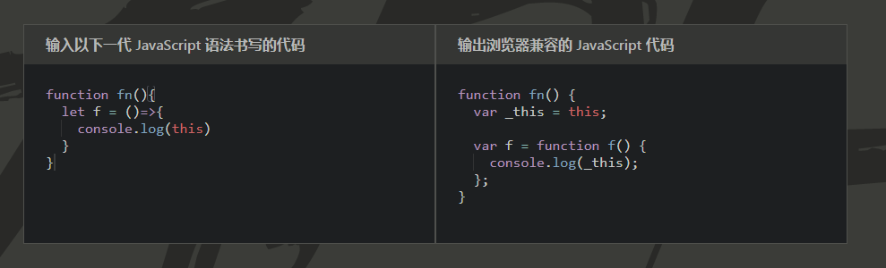

# ES6中的箭头函数

## 前言

这篇文章，前前后后，整理了一周多的时间，下了很多心思。可能有人会说，一个箭头函数而已，没什么难度的，好的，你是大牛，你是大神，但我相信更多人目前还走在成为大牛，成为大神的路上。我相信，至少一小部分人，看过这篇文章，还是会有些许收获的。

学海无涯苦作舟，共同学习，共同进步，与君共勉。

## 引言

在 ES6 中，箭头函数是其中最有趣也最受欢迎的新增特性。

本文会分为三个部分来介绍：

第一部主要介绍箭头函数的基本语法与使用方式，其中关于**this的指向**问题会着重介绍。

第二部分探究一下箭头函数在**自执行函数**中的奇怪现象。

第三部分将提供一些**面试题目**，用于帮助大家理解。

## 什么是箭头函数

顾名思义，箭头函数是一种使用 (=>) 定义函数的新语法，它与传统的 ES5 函数有些许不同。

这是一个用 ES5 语法编写的函数：

```javascript
function addTen（num）{
  return num + 10;
}
timesTwo（5); // 15
```

有了 ES6 的箭头函数后，我们可以用箭头函数这样表示：

```javascript
var addTen = num => num + 10

addTen(5); // 15
```

箭头函数的写法短的多！由于隐式返回，我们可以省略花括号和 return 语句。

与常规 ES5 函数相比，了解箭头函数的行为方式非常重要。

## 箭头函数的特点

### 更短的语法

基础语法如下：

```javascript
（参数）=> { statements }
```

接下来，拆解一下箭头函数的各种书写形式：

当没有参数时，使用一个圆括号代表参数部分

```javascript
let f = ()=> 5;

f(); // 5
```

当只有一个参数时，可以省略圆括号。

```javascript
let f = num => num + 5;

f(10); // 15
```

当有多个参数时，在圆括号内定义多个参数用逗号分隔。

```javascript
let f = (a,b) => a + b;

f(1,2); // 3
```

当箭头函数的代码块部分多余一条语句，就需要使用大括号括起来，并且使用 return 语句。

```javascript
// 没有大括号，默认返回表达式结果
let f1 = (a,b) => a + b
f1(1,2) // 3

// 有大括号，无return语句，没有返回值
let f2 = (a,b) => {a + b}
f2(1,2) // undefined

// 有大括号，有return语句，返回结果
let f3 = (a,b) => {return a + b}
f3(1,2) // 3
```

由于大括号被解释为代码块，所以如果箭头函数直接返回一个对象，必须在对象外面加上括号，否则会报错。

```javascript
//报错
let f1 = num => {num:num}

//不报错
let f2 = num => ({num:num})
```

### 不能通过 new 关键字调用

箭头函数没有[[Construct]]方法，所以不能被用作构造函数。

```javascript
let F = ()=>{};

// 报错 TypeError: F is not a constructor
let f = new F();
```

### 没有原型

由于不可以通过 new 关键字调用，因而没有构建原型的需求，所以箭头函数不存在 prototype 这个属性。

```javascript
let F = ()=>{};
console.log(F.prototype) // undefined
```

### 不能用作 Generator 函数

在箭头函数中，不可以使用 yield 命令，因此箭头函数不能用作 Generator 函数。

### 没有 arguments、super、new.target

箭头函数中是没有 arguments、super、new.target 的绑定，这些值由外围最近一层非箭头函数决定。

以 arguments 为例，看如下代码：

```javascript
let f = ()=>console.log(arguments);

//报错
f(); // arguments is not defined
```

由于在全局环境下，定义箭头函数 f，对于 f 来说，无法获取到外围非箭头函数的 arguments 值，所以此处报错。

再看一个例子：

```javascript
function fn(){
    let f = ()=> console.log(arguments)
    f();
}
fn(1,2,3) // [1,2,3]
```

上面的代码，箭头函数 f 内部的 arguments，其实是函数 fn 的 arguments 变量。

若想在箭头函数中获取不定长度的参数列表，可以使用 ES6 中的 rest 参数解决：

```javascript
let f = (...args)=>console.log(args)

f(1,2,3,4,5) // [1,2,3,4,5]
```

### 没有 this 绑定

在理解箭头函数中的this指向问题之前，我们先来回看在 ES5 中的一个例子：

```javascript
var obj = {
  value:0,
  fn:function(){
    this.value ++
  }
}
obj.fn();
console.log(obj.value); // 1
```

这段代码很简单，在每次调用 obj.fn() 时，期望的是将 obj.value 加 1。

现在我们将代码修改一下：

```javascript
var obj = {
  value:0,
  fn:function(){
    var f = function(){
      this.value ++
    }
    f();
  }
}
obj.fn();
console.log(obj.value); // 0
```

我们将代码修改了一下，在 obj.fn 方法内增加了一个函数 f ，并将 obj.value 加 1 的动作放到了函数 f 中。但是由于 javascript 语言设计上的一个错误，函数 f 中的 this 并不是 方法 obj.fn 中的 this，导致我们没法获取到 obj.value 。

为了解决此类问题，在 ES5 中，我们通常会将外部函数中的 this 赋值给一个临时变量（通常命名为 that、_this、self），在内层函数中若希望使用外层函数的 this 时，通过这个临时变量来获取。修改代码如下：

```javascript
var obj = {
  value:0,
  fn:function(){
    // 本人喜欢定义为 _this，也有很多人喜欢定义成 that 或 self
    var _this = this;
    var f = function(){
      _this.value ++
    }
    f();
  }
}
obj.fn();
console.log(obj.value); // 1
```

从这个例子中，我们知道了在 ES5 中如何解决内部函数获取外部函数 this 的办法。

然后我们来看看箭头函数相对于 ES5 中的函数来说，它的 this 指向有和不同。

先看一段定义，来源于[ES6标准入门](https://book.douban.com/subject/27127030/)

> **箭头函数体内的 this 对象就是定义时所在的对象，而不是使用时所在的对象。**

那么，如何来理解这句话呢？

我们尝试用[babel](https://www.babeljs.cn/)来将如下代码转换成 ES5 格式的代码，看看它都做了什么。

```javascript
function fn(){
  let f = ()=>{
    console.log(this)
  }
}
```

来看看转化后的结果，直接上图：



我们发现了什么，居然和我们之前在 ES5 中解决内层函数获取外层函数 this 的方法一样，定义一个临时变量 _this ~

那么，箭头函数自己的 this 哪里去了?

答案是，箭头函数根本没有自己的 this ！

那么，我们可以总结一下，将晦涩难懂的定义转化成白话文：

+ 箭头函数的外层如果有普通函数，那么箭头函数的 this 就是外层普通函数的this
+ 箭头函数的外层如果没有普通函数，那么箭头函数的 this 就是全局变量

让我们用几个例子，来验证一下我们总结的规则：

```javascript
let obj = {
    fn:function(){
        console.log('我是普通函数',this === obj)
        return ()=>{
            console.log('我是箭头函数',this === obj)
        }
    }
}

console.log(obj.fn()())

// 我是普通函数 true
// 我是箭头函数 true
```

从上面的例子，我们能够看出，箭头函数的 this 与外层函数的 this 是相等的。

在看一个多层箭头函数嵌套的例子：

```javascript
let obj = {
    fn:function(){
        console.log('我是普通函数',this === obj)
        return ()=>{
            console.log('第一个箭头函数',this === obj)
            return ()=>{
                console.log('第二个箭头函数',this === obj)
                return ()=>{
                    console.log('第三个箭头函数',this === obj)
                }
            }
        }
    }
}

console.log(obj.fn()()()())
// 我是普通函数 true
// 第一个箭头函数 true
// 第二个箭头函数 true
// 第三个箭头函数 true
```

在这个例子中，我们能够知道，对于箭头函数来说，箭头函数的 this 与外层的第一个普通函数的 this 相等，与嵌套了几层箭头函数无关。

再来看一个没有外层函数的例子：

```javascript
let obj = {
    fn:()=>{
        console.log(this === window);
    }
}

console.log(obj.fn())

// true
```

这个例子，证明了，在箭头函数外层没有普通函数时，箭头函数的 this 与全局对象相等。

需要注意的是，浏览器环境下全局对象为 window，node 环境下全局对象为 global，验证的时候需要区分一下。

### 箭头函数碰上 call、apply、bind

看到这里，相信大家已经知道了，箭头函数中根本没有自己的 this ,那么当箭头函数碰到 call、apply、bind 时，会发生什么呢？

我们知道，call 和 apply 的作用是改变函数 this 的指向，传递参数，并将函数执行，
而 bind 的作用是生成一个绑定 this 并预设函数参数的新函数。

然而由于箭头函数根本没有自己的 this ，所以：

+ 当对箭头函数使用 call 或 apply 方法时，只会传入参数并调用函数，并不会改变箭头函数中 this 的指向；
+ 当对箭头函数使用 bind 方法时，只会返回一个预设参数的新函数，并不会绑定新函数的 this 指向。

我们来验证一下：

```javascript
window.name = 'window_name';

let f1 = function(){return this.name}
let f2 = ()=> this.name

let obj = {name:'obj_name'}

f1.call(obj) // obj_name
f2.call(obj) // window_name

f1.apply(obj) // obj_name
f2.apply(obj) // window_name

f1.bind(obj)() // obj_name
f2.bind(obj)() // window_name
```

上面代码中，声明了普通函数 f1，箭头函数 f2。

普通函数的 this 指向是动态可变的，所以在对 f1 使用 call、apply、bind 时，f1 内部的 this 指向会发生改变。

箭头函数的 this 指向在其定义时就已确定，永远不会发生改变，所以在对 f2 使用 call、apply、bind 时，会忽略传入的上下文参数。

## 自执行函数

在 ES6 的箭头函数出现之前，自执行函数一般会写成这样：

```javascript
(function(){
    console.log(1)
})()
```

或者写成这样：

```javascript
(function(){
    console.log(1)
}())
```

箭头函数当然也可以被用作自执行函数，可以这样写：

```javascript
(() => {
    console.log(1)
})()
```

但是，令大多数人想不到的是，下面这种写法会报错：

```javascript
(() => {
    console.log(1)
}())
```

那么，为什么会报错呢？

这个问题，曾困扰了我很久，直到我翻阅了[ECMAScript® 2015 规范](https://www.ecma-international.org/ecma-262/6.0/#sec-arrow-function-definitions)，从中得知箭头函数是属于 AssignmentExpression 的一种，而函数调用属于 CallExpression，规范中要求当 CallExpression 时，左边的表达式必须是 MemberExpression 或其他的 CallExpression，而箭头函数不属于这两种表达式，所以在编译时就会报错。

原理就是这样了，具体可参见[ECMAScript® 2015 规范](https://www.ecma-international.org/ecma-262/6.0/#sec-arrow-function-definitions)

## 关于箭头函数的题目

在面试中关于箭头函数的考察，主要集中在 arguments 关键字的指向和箭头函数的this指向上，下面几道题目，由浅入深，供大家参考一下。

### 题目一

```javascript
function foo(n) {
  var f = () => arguments[0] + n;
  return f();
}

let res = foo(2);

console.log(res); // 问 输出结果
```

<details>
  <summary><b>答案及解析</b></summary>
<p>
答案: 4

箭头函数没有自己的 arguments ，所以题中的 arguments 指代的是 foo 函数的 arguments 对象。所以 arguments[0] 等于 2 ，n 等于 2，结果为 4。

</p>
</details>

### 题目二

```javascript
function A() {
  this.foo = 1
}

A.prototype.bar = () => console.log(this.foo)

let a = new A()
a.bar() // 问 输出结果
```

<details><summary><b>答案</b></summary>

<p>

答案: undefined

箭头函数没有自己的 this，所以箭头函数的 this 等价于外层非箭头函数作用域的this。
由于箭头函数的外层没有普通函数，所以箭头函数中的 this 等价于全局对象，所以输出为 undefined。

</p>
</details>

### 题目三

```javascript
let res = (function pt() {
  return (() => this.x).bind({ x: 'inner' })();
}).call({ x: 'outer' });

console.log(res)  // 问 输出结果
```

<details><summary><b>答案</b></summary>
<p>

答案：'outer'

此题稍微复杂一点，求 res 的输出结果。

分析如下：

1. 求函数 pt 通过 call 调用后的返回值。
2. pt 函数内的 this 被 call 转换为 {x:'outer'}。
3. pt 函数内，箭头函数通过 bind 生成了新函数，并执行，执行结果为 pt 函数的返回值。
4. 箭头函数中的 this 无法通过 bind 方法绑定，箭头函数执行时的 this 就是外层作用域的 this。
5. 箭头函数执行时，外层作用域的 this 是由 call 方法指定的 {x:'outer'}。
6. 最终结果 res 为 'outer'。

</p>
</details>

### 题目四

```javascript
window.name = 'window_name';

let obj1 = {
    name:'obj1_name',
    print:()=>console.log(this.name)
}

let obj2 = {name:'obj2_name'}

obj1.print()  // 问 输出结果
obj1.print.call(obj2)  // 问 输出结果
```

<details><summary><b>答案</b></summary>
<p>

答案：'window_name'  'window_name'

箭头函数没有自己的 this ，也无法通过 call、apply、bind 改变箭头函数中的 this。
箭头函数的 this 取决于外层是否有普通函数，有普通函数 this 指向普通函数中的this，外层没有普通函数，箭头函数中的 this 就是全局对象。

此题中，箭头函数外层没有普通函数，所以 this 指向全局对象，所以结果为 'window_name'、'window_name'。
</p>
</details>

### 题目五

```javascript
let obj1 = {
    name:'obj1_name',
    print:function(){
        return ()=>console.log(this.name)
    }
}

let obj2 = {name:'obj2_name'}


obj1.print()() // 问 输出结果
obj1.print().call(obj2) // 问 输出结果
obj1.print.call(obj2)() // 问 输出结果
```

<details><summary><b>答案</b></summary>
<p>
答案: 'obj1_name' 'obj1_name' 'obj2_name'

箭头函数的 this 与其外层的普通函数的 this 一致，与 call、apply、bind 无关。

此题，obj1.print 返回一个箭头函数，此箭头函数中的 this 就是 obj1.print 调用时的 this。

1. obj1.print()()：此时obj1.print 中的 this 为 obj1，所以输出为 obj1_name
2. obj1.print().call(obj2)：此时obj1.print 中的 this 为 obj1，所以输出为 obj1_name
3. obj1.print.call(obj2)()：此时obj1.print 中的 this 为 obj2，所以输出为 obj2_name

</p>
</details>

## 参考

+ [深入理解ES6](https://book.douban.com/subject/27072230/)
+ [ES6标准入门](https://book.douban.com/subject/27127030/)
+ [箭头函数和this关键字](https://medium.com/free-code-camp/learn-es6-the-dope-way-part-ii-arrow-functions-and-the-this-keyword-381ac7a32881)
+ [重新认识箭头函数的this](https://github.com/yygmind/blog/issues/21)
+ [ECMAScript® 2015 规范](https://www.ecma-international.org/ecma-262/6.0/#sec-arrow-function-definitions)
