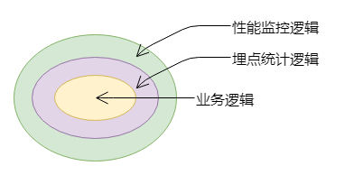
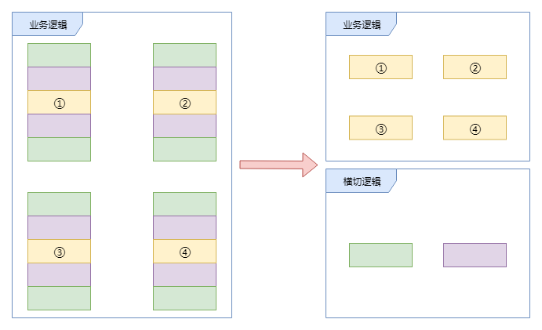

# JS中的面向切面编程

## 前言

面向切面编程（Aspect-oriented programming，AOP）是一种编程范式，在后端开发中被广泛的应用(遥记当前学习spring时的血泪史)，可是在 JavaScript 中，AOP 往往是一个被忽视的技术点。

## AOP到底是什么

先来思考一个场景：

我们有一个表单，其中若干输入框，一个提交按钮，点击按钮时，获取输入框的所有值并向后端发请求，按钮的点击事件函数可能是这样的：

```javascript
function submit(){
    //业务代码--获取所有输入框的值
    let params = getAllInputValue();
    //业务代码--像后端发送请求
    request(url,params);
}
dom.addEventListener('click',submit);
```

后来，我们希望能够统计按钮的点击次数，需要添加埋点信息，我们的代码变成了这样：

```javascript
function submit(){
    //发送埋点信息
    tracking('submit');
    //业务代码--获取所有输入框的值
    let params = getAllInputValue();
    //业务代码--像后端发送请求
    request(url,params)
}
dom.addEventListener('click',submit);
```

再后来，我们希望对按钮事件进行性能监控，查看事件的运行时间，我们的代码又变成了这样：

```javascript
function submit(){
    //记录开始时间
    let startTime = Date.now();
    //发送埋点信息
    tracking('submit');
    //业务代码--获取所有输入框的值
    let params = getAllInputValue();
    //业务代码--像后端发送请求
    request(url,params)
    //记录结束时间
    let endTime = Date.now();
    console.log('性能监控：',endTime - startTime)
}
dom.addEventListener('click',submit);
```

乍一看，貌似没什么问题，我们完美的完成了需求。但仔细的看这段代码，会发现我们的业务代码淹没在重复化非业务性的代码中，性能监控和埋点统计这些非业务性代码葛藤缠树般包围着业务代码。

现在我们假设将 submit 函数看成一段圆木，我们会发现性能监控和埋点统计的代码好像一个年轮，而业务代码是圆木的树心，而这也就是`面向切面编程`这个概念的由来。



为了消除依附在业务方法流程中的横切逻辑，AOP独辟蹊径通过横向抽取机制来解决这一问题。



从上图中，我们可以看出 AOP 通过横向切割的方式，将横切逻辑抽取到一个独立的模块中，还业务逻辑一个清新的世界。

在知道了什么是 AOP 之后，我们接下来看看在 JS 中是如何应用 AOP 的思想。

## 应用 AOP

回看我们之前的例子，一个表单，其中若干输入框，一个提交按钮：

```javascript
function submit(){
    //业务代码--获取所有输入框的值
    let params = getAllInputValue();
    //业务代码--像后端发送请求
    request(url,params);
}
dom.addEventListener('click',submit);
```

如何在不改变原有 submit 函数的情况下，赋予按钮点击时触发埋点统计和性能监控这两种功能呢 ？

在 AOP 中，给主要业务代码增加次要功能的方式，被称之为`增强`，其中又主要分为`前置增强`、`后置增强`和`环绕增强`。

`前置增强`指的是在原目标函数执行之前增加新的功能。

`后置增强`指的是在原目标函数执行之后增加新的功能。

`环绕增强`指的是在原目标函数执行前后增加新的功能。

具体到 JS 中，由于语言本身的特性，天生就具有运行时动态插入逻辑的能力，简单实现一下：

```javascript
//前置增强
Function.prototype.before = function(action){
    //保留目标函数
    let curFn = this;
    return function(...args){
        //先执行增强内容
        action.apply(this,args);
        //执行目标函数
        return curFn.apply(this,args);
    }
}
```

```javascript
//后置增强
Function.prototype.after = function(action){
    //保留目标函数
    let curFn = this;
    return function(...args){
        //先执行目标函数
        let res = curFn.apply(this,args);
        //执行增强内容
        action.apply(this,args);
        //返回原始结果
        return res;
    }
}
```

```javascript
//环绕增强
Function.prototype.around = function(beforeAction,afterAction){
    //保留目标函数
    let curFn = this;
    return function(...args){
        //执行前置增强内容,并保留结果
        let beforeRes = beforeAction.call(this,...args);
        //执行目标函数
        let res = curFn.apply(this,args);
        //执行后置增强内容，并传入前置增强结果
        afterAction.call(this,beforeRes,...args);
        //返回原始结果
        return res;
    }
}
```

三种增强的方法有了，现在把他们用在之前的例子中。

增加埋点统计：

```javascript
function submit(){
    //业务代码--获取所有输入框的值
    let params = getAllInputValue();
    //业务代码--像后端发送请求
    request(url,params)
}
//增加了埋点统计功能的submit函数
let _submit = submit.before(function(){
    //发送埋点信息
    tracking('submit');
})

dom.addEventListener('click',_submit);
```

在已经增加了埋点统计的基础上增加性能监控：

```javascript
function submit(){
    //业务代码--获取所有输入框的值
    let params = getAllInputValue();
    //业务代码--像后端发送请求
    request(url,params)
}
//增加了埋点统计功能的submit函数
let _submit = submit.before(function(){
    //发送埋点信息
    tracking('submit');
})

//增加了性能监控功能的submit函数
let __submit = _submit.around(function(){
    return Date.now();
},function(startTime){
    let endTime = Date.now();
    console.log('性能监控：',endTime - startTime)
})
dom.addEventListener('click',__submit);
```

现在我们应用 AOP 的思想，在不改变原始业务代码的情况下，通过增强的方式，实现了添加埋点统计和性能监控的需求。

## AOP 优点

说了这么多，总结一下，使用 AOP 的好处：

+ 保持业务逻辑的纯净和高内聚性
+ 编写业务代码时，只需关心核心业务处理，提高效率保证代码简洁
+ 由于业务代码与公共代码分离，日后维护更加方便轻松
