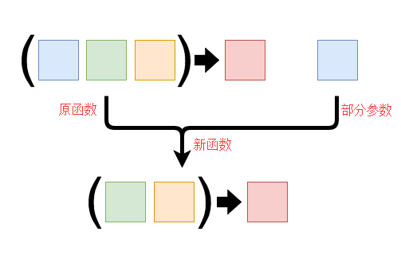

# 偏函数

## 前言

偏函数应用，英文是partial application，也被译作“部分应用”、“部分应用”、“偏应用”，下文为统一术语，统称为部分应用。

那么什么是部分应用？

在计算机科学中，部分应用是指固定一个函数的一些参数，然后产生另一个更小元的函数。

什么是元？元是指函数参数的个数，比如一个带有两个参数的函数被称为二元函数。

举个例子：

```javascript
function add(a,b){
    return a + b;
}
// 执行 add 函数，一次传入两个参数即可
add(1, 2) // 3

// 假设有一个 partial 函数可以做到部分应用
let addByOne = partial(add, 1);

addByOne(2) // 3
```

## 函数柯里化与偏函数

柯里化和部分应用二者非常相似，都是旨在实现将具有多个参数的函数转换为参数较少的函数。

上一篇文章[函数柯里化](https)已经详尽的解释了柯里化的应用场景及解析实现，简单来说，柯里化函数将被分成许多个链式函数，只有传入的参数数量满足要求，函数才会被调用。

然而对于部分应用来说，没有对于传入参数的数量的限制，我们可以使用任意数量的参数来应用它，我们只知道通过部分应用返回的函数将比原始函数的参数要少。

用一张图来解释一下：



概括起来，二者区别如下：

+ 柯里化是将一个多参数函数转换成多个单参数函数，也就是将一个 n 元函数转换成 n 个一元函数。
+ 部分应用则是固定一个函数的一个或者多个参数，也就是将一个 n 元函数转换成一个 n - x 元函数。

## 实现 partial

根据部分应用的概念，我们简单实现如下：

```javascript
function partial(fn,...args){
    return function(...params){
        return fn.apply(this,[...args,...params])
    }
}
```

通过几个例子，我们来验证一下：

```javascript
function add(a,b,c){
    return a + b + c;
}

let addByOne = partial(add, 1);
let addByOneAndTwo = partial(add, 1,2);

addByOne(2,3); // 6
addByOneAndTwo(3); // 6
```

上面的例子，已经实现了部分应用，代码非常的简单。

我们接着思考，对于之前实现的 partial 函数，我们在应用并传递参数的时候，只能按照参数的顺序依次传递，那么如果我们希望选择性的传递参数呢？

比如说，函数 fn 共接收 3 个参数，在使用 partial 函数生成部分应用时，传递第一个参数和第三个参数，由生成的部分应用来接收 fn 所需的第二个参数。

用一段伪代码表示如下

```javascript
function fn(a,b,c,d,e){
    console.log(a,b,c,d,e)
}
let _fn = partial(fn,_,2,3,_,5); // _ 代表占位符

_fn(1,2); // 1 2 3 4 5
```

接下来我们来实现具有占位符功能的 partial 函数

```javascript
function partial(fn,...args){
    // 将 partial 函数自身作为占位符来进行判断
    // 可根据情况自行更替，lodash中将lodash自身作为占位符进行判断
    let _ = partial;
    return function(...params){
        let position = 0;
        let _args = args.reduce((init,cur)=>{
            return init.concat(cur === _ ? params[position++] : cur);
        },[])
        return fn.apply(this,_args.concat(params.slice(position)))
    }
}
```

在代码实现中，我们简单的将 partial 自身作为占位符，这里可有不同的实现，比如lodash库中的 partial 函数，就是使用lodash自身来作为占位符的。

验证一下：

```javascript
function fn(a,b,c,d,e){
    console.log(a,b,c,d,e)
}

let _ = partial; // 占位符

let _fn1 = partial(fn,_,2,3,_,5);
let _fn2 = partial(fn,1,2,3,_,5);
let _fn3 = partial(fn,1,2,_,_,5);
let _fn4 = partial(fn,_,2,_,_,5);

_fn1(1,4);      // 1 2 3 4 5
_fn2(4);        // 1 2 3 4 5
_fn3(3,4);      // 1 2 3 4 5
_fn4(1,3,4);    // 1 2 3 4 5
```

## 参考

+ [JavaScript权威指南](https://book.douban.com/subject/10549733/)
+ [JavaScript 函数式编程](https://book.douban.com/subject/26579320/)
+ [Currying VS Partial](https://codeburst.io/javascript-currying-vs-partial-application-4db5b2442be8)
