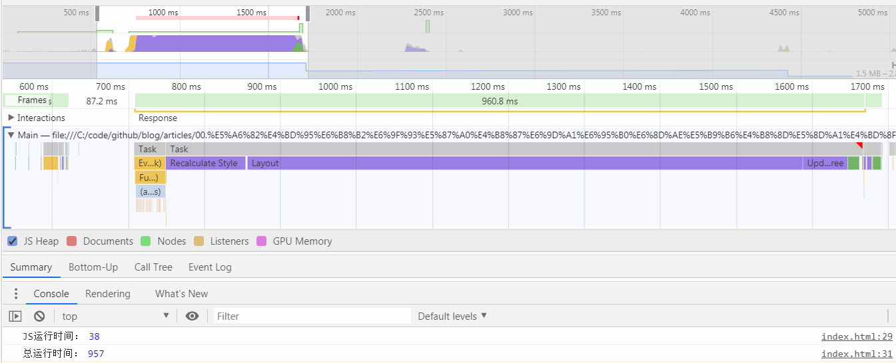
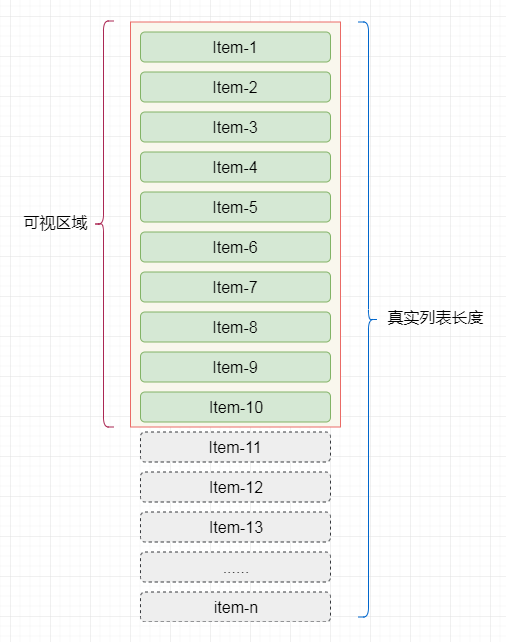

## 前言

在工作中，有时会遇到需要一些不能使用分页方式来加载列表数据的业务情况，对于此，我们称这种列表叫做`长列表`。比如，在一些外汇交易系统中，前端会实时的展示用户的持仓情况(收益、亏损、手数等)，此时对于用户的持仓列表一般是不能分页的。

在[高性能渲染十万条数据(时间分片)](https://juejin.im/post/5d76f469f265da039a28aff7)一文中，提到了可以使用`时间分片`的方式来对长列表进行渲染，但这种方式更适用于列表项的DOM结构十分简单的情况。本文会介绍使用`虚拟列表`的方式，来同时加载大量数据。

## 为什么需要使用虚拟列表

假设我们的长列表需要展示10000条记录，我们同时将10000条记录渲染到页面中，先来看看需要花费多场时间：

```html
<button id="button">button</button><br>
<ul id="container"></ul>  
```

```javascript
document.getElementById('button').addEventListener('click',function(){
    // 记录任务开始时间
    let now = Date.now();
    // 插入一万条数据
    const total = 10000;
    // 获取容器
    let ul = document.getElementById('container');
    // 将数据插入容器中
    for (let i = 0; i < total; i++) {
        let li = document.createElement('li');
        li.innerText = ~~(Math.random() * total)
        ul.appendChild(li);
    }
    console.log('JS运行时间：',Date.now() - now);
    setTimeout(()=>{
      console.log('总运行时间：',Date.now() - now);
    },0)

    // print JS运行时间： 38
    // print 总运行时间： 957
  })
```

当我们点击按钮，会同时向页面中加入一万条记录，通过控制台的输出，我们可以粗略的统计到，JS的运行时间为`38ms`,但渲染完成后的总时间为`957ms`。

简单说明一下，为何两次`console.log`的结果时间差异巨大，并且是如何简单来统计`JS运行时间`和`总渲染时间`：

+ 在 JS 的`Event Loop`中，当JS引擎所管理的执行栈中的事件以及所有微任务事件全部执行完后，才会触发渲染线程对页面进行渲染
+ 第一个`console.log`的触发时间是在页面进行渲染之前，此时得到的间隔时间为JS运行所需要的时间
+ 第二个`console.log`是放到 setTimeout 中的，它的触发时间是在渲染完成，在下一次`Event Loop`中执行的

[关于Event Loop的详细内容请参见这篇文章-->](https://juejin.im/post/5d5b4c2df265da03dd3d73e5)

然后，我们通过`Chrome`的`Performance`工具来详细的分析这段代码的性能瓶颈在哪里：



从`Performance`可以看出，代码从执行到渲染结束，共消耗了`960.8ms`,其中的主要时间消耗如下：

+ Event(click) : `40.84ms`
+ Recalculate Style : `105.08ms`
+ Layout : `731.56ms`
+ Update Layer Tree : `58.87ms`
+ Paint : `15.32ms`

从这里我们可以看出，我们的代码的执行过程中，消耗时间最多的两个阶段是`Recalculate Style`和`Layout`。

+ `Recalculate Style`：样式计算，浏览器根据css选择器计算哪些元素应该应用哪些规则，确定每个元素具体的样式。
+ `Layout`：布局，知道元素应用哪些规则之后，浏览器开始计算它要占据的空间大小及其在屏幕的位置。

在实际的工作中，列表项必然不会像例子中仅仅只由一个li标签组成，必然是由复杂DOM节点组成的。

那么可以想象的是，当列表项数过多并且列表项结构复杂的时候，同时渲染时，会在`Recalculate Style`和`Layout`阶段消耗大量的时间。

而`虚拟列表`就是解决这一问题的一种实现。

## 什么是虚拟列表

`虚拟列表`其实是按需显示的一种实现，即只对`可见区域`进行渲染，对`非可见区域`中的数据不渲染或部分渲染的技术，从而达到极高的渲染性能。

假设我们屏幕的`可见区域`的高度为`500px`,而列表项的高度为`50px`，则此时我们在屏幕中最多只能看到10个列表项，那么在首次渲染的时候，不管列表项数共有多少条，我们只需加载10条即可。



当滚动发生时，通过计算当前滚动值得知此时在屏幕`可见区域`应该显示的列表项。

假设我们屏幕的`可见区域`的高度为`500px`,而列表项的高度为`50px`，且滚动发生，滚动条距顶部的位置为`150px`,则我们可得知在`可见区域`内的列表项为`第4项`至`第13项`。


## 实现

## 列表项固定高度

## 缓存计算结果

## 列表项动态高度

## 


## 系列文章推荐

## 参考

+ [浅说虚拟列表的实现原理](https://github.com/dwqs/blog/issues/70)


## 写在最后

+ 文中如有错误，欢迎在评论区指正，如果这篇文章帮到了你，欢迎`点赞`和`关注`
+ 本文同步首发与[github](https://github.com/chenqf/frontEndBlog)，可在[github](https://github.com/chenqf/frontEndBlog)中找到更多精品文章，欢迎`Watch` & `Star ★`
+ 后续文章参见：[计划](https://github.com/chenqf/frontEndBlog/blob/master/PLAN.md)

> 欢迎关注微信公众号`【前端小黑屋】`，每周1-3篇精品优质文章推送，助你走上进阶之旅


> 同时欢迎加我好友，回复`加群`，拉你入群，和我一起学前端~


