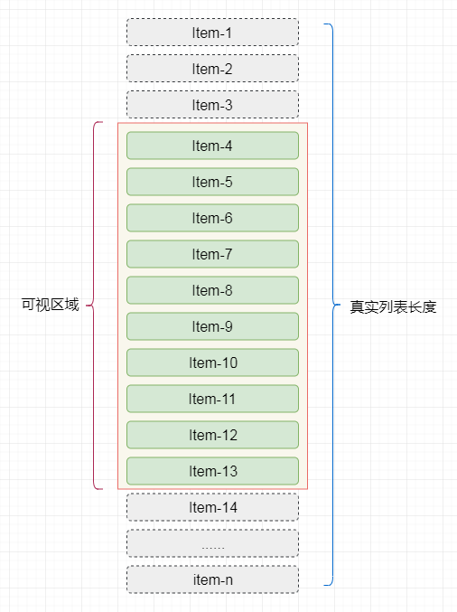
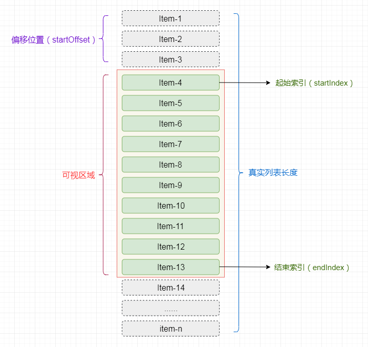
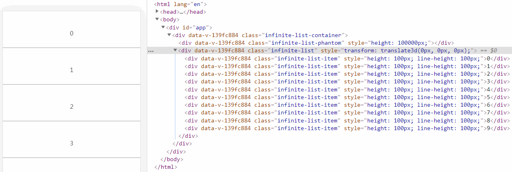

## 前言

在工作中，有时会遇到需要一些不能使用分页方式来加载列表数据的业务情况，对于此，我们称这种列表叫做`长列表`。比如，在一些外汇交易系统中，前端会实时的展示用户的持仓情况(收益、亏损、手数等)，此时对于用户的持仓列表一般是不能分页的。

在[高性能渲染十万条数据(时间分片)](https://juejin.im/post/5d76f469f265da039a28aff7)一文中，提到了可以使用`时间分片`的方式来对长列表进行渲染，但这种方式更适用于列表项的DOM结构十分简单的情况。本文会介绍使用`虚拟列表`的方式，来同时加载大量数据。

## 为什么需要使用虚拟列表

假设我们的长列表需要展示10000条记录，我们同时将10000条记录渲染到页面中，先来看看需要花费多场时间：

```html
<button id="button">button</button><br>
<ul id="container"></ul>  
```

```javascript
document.getElementById('button').addEventListener('click',function(){
    // 记录任务开始时间
    let now = Date.now();
    // 插入一万条数据
    const total = 10000;
    // 获取容器
    let ul = document.getElementById('container');
    // 将数据插入容器中
    for (let i = 0; i < total; i++) {
        let li = document.createElement('li');
        li.innerText = ~~(Math.random() * total)
        ul.appendChild(li);
    }
    console.log('JS运行时间：',Date.now() - now);
    setTimeout(()=>{
      console.log('总运行时间：',Date.now() - now);
    },0)

    // print JS运行时间： 38
    // print 总运行时间： 957
  })
```

当我们点击按钮，会同时向页面中加入一万条记录，通过控制台的输出，我们可以粗略的统计到，JS的运行时间为`38ms`,但渲染完成后的总时间为`957ms`。

简单说明一下，为何两次`console.log`的结果时间差异巨大，并且是如何简单来统计`JS运行时间`和`总渲染时间`：

+ 在 JS 的`Event Loop`中，当JS引擎所管理的执行栈中的事件以及所有微任务事件全部执行完后，才会触发渲染线程对页面进行渲染
+ 第一个`console.log`的触发时间是在页面进行渲染之前，此时得到的间隔时间为JS运行所需要的时间
+ 第二个`console.log`是放到 setTimeout 中的，它的触发时间是在渲染完成，在下一次`Event Loop`中执行的

[关于Event Loop的详细内容请参见这篇文章-->](https://juejin.im/post/5d5b4c2df265da03dd3d73e5)

然后，我们通过`Chrome`的`Performance`工具来详细的分析这段代码的性能瓶颈在哪里：


从`Performance`可以看出，代码从执行到渲染结束，共消耗了`960.8ms`,其中的主要时间消耗如下：

+ Event(click) : `40.84ms`
+ Recalculate Style : `105.08ms`
+ Layout : `731.56ms`
+ Update Layer Tree : `58.87ms`
+ Paint : `15.32ms`

从这里我们可以看出，我们的代码的执行过程中，消耗时间最多的两个阶段是`Recalculate Style`和`Layout`。

+ `Recalculate Style`：样式计算，浏览器根据css选择器计算哪些元素应该应用哪些规则，确定每个元素具体的样式。
+ `Layout`：布局，知道元素应用哪些规则之后，浏览器开始计算它要占据的空间大小及其在屏幕的位置。

在实际的工作中，列表项必然不会像例子中仅仅只由一个li标签组成，必然是由复杂DOM节点组成的。

那么可以想象的是，当列表项数过多并且列表项结构复杂的时候，同时渲染时，会在`Recalculate Style`和`Layout`阶段消耗大量的时间。

而`虚拟列表`就是解决这一问题的一种实现。

## 什么是虚拟列表

`虚拟列表`其实是按需显示的一种实现，即只对`可见区域`进行渲染，对`非可见区域`中的数据不渲染或部分渲染的技术，从而达到极高的渲染性能。

假设有1万条记录需要同时渲染，我们屏幕的`可见区域`的高度为`500px`,而列表项的高度为`50px`，则此时我们在屏幕中最多只能看到10个列表项，那么在首次渲染的时候，我们只需加载10条即可。


说完首次加载，再分析一下当滚动发生时，我们可以通过计算当前滚动值得知此时在屏幕`可见区域`应该显示的列表项。

假设滚动发生，滚动条距顶部的位置为`150px`,则我们可得知在`可见区域`内的列表项为`第4项`至`第13项。



## 实现

虚拟列表的实现，实际上就是在首屏加载的时候，只加载`可视区域`内需要的列表项，当滚动发生时，动态通过计算获得`可视区域`内的列表项，并将`非可视区域`内存在的列表项删除。

+ 计算当前`可视区域`起始数据索引(`startIndex`)
+ 计算当前`可视区域`结束数据索引(`endIndex`)
+ 计算当前`可视区域的`数据，并渲染到页面中
+ 计算`startIndex`对应的数据在整个列表中的偏移位置`startOffset`并设置到列表上



由于只是对`可视区域`内的列表项进行渲染，所以为了保持列表容器的高度并可正常的触发滚动，将Html结构设计成如下结构：

```html
<div class="infinite-list-container">
    <div class="infinite-list-phantom"></div>
    <div class="infinite-list">
      <!-- item-1 -->
      <!-- item-2 -->
      <!-- ...... -->
      <!-- item-n -->
    </div>
</div>
```

+ `infinite-list-container` 为`可视区域`的容器
+ `infinite-list-phantom` 为容器内的占位，高度为总列表高度，用于形成滚动条
+ `infinite-list` 为列表项的`渲染区域`

接着，监听`infinite-list-container`的`scroll`事件，获取滚动位置`scrollTop`

+ 假定`可视区域`高度固定，称之为`screenHeight`
+ 假定`列表每项`高度固定，称之为`itemSize`
+ 假定`列表数据`称之为`listData`
+ 假定`当前滚动位置`称之为`scrollTop`

则可推算出：

+ 列表总高度`listHeight` = listData.length * itemSize
+ 可显示的列表项数`visibleCount` = Math.ceil(screenHeight / itemSize)
+ 数据的起始索引`startIndex` = Math.floor(scrollTop / itemSize)
+ 数据的结束索引`endIndex` = startIndex + visibleCount
+ 列表显示数据为`visibleData` = listData.slice(startIndex,endIndex)

当滚动后，由于`渲染区域`相对于`可视区域`已经发生了偏移，此时我需要获取一个偏移量`startOffset`，通过样式控制将`渲染区域`偏移至`可视区域`中。

+ 偏移量`startOffset` = scrollTop - (scrollTop % itemSize);

[点击查看在线DEMO](https://jsfiddle.net/chenqf/1f26d7ya)，简易代码如下：

[点击查看在线DEMO](https://codesandbox.io/s/listview-1-sudt3)，简易代码如下：

```html
<template>
  <div ref="list" class="infinite-list-container" @scroll="scrollEvent($event)">
    <div class="infinite-list-phantom" :style="{ height: listHeight + 'px' }"></div>
    <div class="infinite-list" :style="{ transform: getTransform }">
      <div ref="items"
        class="infinite-list-item" 
        v-for="item in visibleData" 
        :key="item.value"
        :style="{ height: itemSize + 'px',lineHeight: itemSize + 'px' }"
        >{{ item.value }}</div>
    </div>
  </div>
</template>
```

```javascript
export default {
  props: {
    //所有列表数据
    listData:{
      type:Array,
      default:()=>[]
    },
    //每项高度
    itemSize: {
      type: Number
    }
  },
  computed:{
    //列表总高度
    listHeight(){
      return this.listData.length * this.itemSize;
    },
    //可显示的列表项数
    visibleCount(){
      return Math.ceil(this.screenHeight / this.itemSize);
    },
    //偏移量对应的style
    getTransform(){
      return `translate3d(0,${this.startOffset}px,0)`;
    },
    //获取真实显示列表数据
    visibleData(){
      return this.listData.slice(this.start, Math.min(this.end,this.listData.length));
    }
  },
  mounted() {
    this.screenHeight = this.$el.clientHeight;
    this.start = 0;
    this.end = this.start + this.visibleCount;
  },
  data() {
    return {
      //可视区域高度
      screenHeight:0,
      //偏移量
      startOffset:0,
      //起始索引
      start:0,
      //结束索引
      end:null,
    };
  },
  methods: {
    scrollEvent() {
      //当前滚动位置
      let scrollTop = this.$refs.list.scrollTop;
      //此时的开始索引
      this.start = Math.floor(scrollTop / this.itemSize);
      //此时的结束索引
      this.end = this.start + this.visibleCount;
      //此时的偏移量
      this.startOffset = scrollTop - (scrollTop % this.itemSize);
    }
  }
};
```

演示效果：



## 列表项动态高度

在之前的实现中，列表项的高度是固定的，因为高度固定，所以可以很轻易的获取列表项的整体高度以及滚动时的显示数据与对应的偏移量。而实际应用的时候，当列表中包含文本之类的可变内容，会导致列表项的高度并不相同。

比如这种情况：


在虚拟列表中应用动态高度的解决方案一般有如下三种：

> 1.对组件属性`itemSize`进行扩展，支持传递类型为`数字`、`数组`、`函
数`

+ 可以是一个固定值，如 100，此时列表项是固高的
+ 可以是一个包含所有列表项高度的数据，如 [50, 20, 100, 80, ...]
+ 可以是一个根据列表项索引返回其高度的函数：(index: number): number

这种方式虽然有比较好的灵活度，但仅适用于可以预先知道或通过计算得知列表项高度的情况，依然无法解决列表项高度由内容撑开的情况。

> 2.将列表项`渲染到屏幕外`，对其高度进行测量并缓存，然后再将其渲染至可视区域内。

由于预先渲染至屏幕外，再渲染至屏幕内，这导致渲染成本增加一倍，这对于数百万用户在低端移动设备上使用的产品来说是不切实际的。

> 3.以`预估高度`先行渲染，然后获取真实高度并缓存。

这是我选择的实现方式，可以避免前两种方案的不足。

接下来，来看如何简易的实现：

定义组件属性`estimatedItemSize`,用于接收传递的`预估高度`

```javascript
props: {
  //预估高度
  estimatedItemSize:{
    type:Number
  }
}
```

在组件数据中定义`cache`，用于列表项渲染后存储每一项的位置信息，并存储已渲染过的列表项数及高度总和。

```javascript
data(){
  return {
    cache:{
      positions:[
        // {
        //   top:顶部距离列表头的距离
        //   bottom:底部距离列表头的距离
        //   height:实际高度（bottom - top）
        // }
      ],
      knownSize:0,//已渲染过的列表项的高度总和(单位PX)
      knownNum:0,//已渲染过的列表项数
    }
  }
}
```

由于列表项高度不定，所以将获取列表总高度的计算方法变更：

```javascript
//列表总高度
listHeight(){
  return this.cache.knownSize + (this.listData.length - this.cache.knownNum) * this.estimatedItemSize
}
```

由于需要在渲染完成后，获取列表每项的位置信息并缓存，所以使用钩子函数`updated`来实现：

```javascript
updated(){
  let items = Array.from(this.$refs.items);
  let scrollTop = this.$refs.list.scrollTop;
  items.forEach((el,i)=>{
      let rect = el.getBoundingClientRect();
      let top = rect.top + scrollTop;
      let bottom = rect.bottom + scrollTop;
      let height = bottom - top;
      //当前节点在总列表中的索引
      let index = this.start + i;
      //当前节点不存在缓存
      if(!this.cache.positions[index]){
          //修改已知的列表项总高度
          this.cache.knownSize = this.cache.knownSize + height;
          //修改已知的列表项数量
          this.cache.knownNum ++ ;
          //缓存节点的位置信息
          this.cache.positions[index] = {
            id:el.id,
            index,
            top,
            bottom,
            height
          }
      }
  })
}
```

滚动后获取列表开始索引的方法修改为通过缓存获取：

```javascript
getStartIndex(scrollTop = 0){
  let item = this.cache.positions.find(i => i && i.bottom > scrollTop);
  return item.index;
}
```

滚动后将偏移量的获取方式变更：

```javascript
scrollEvent() {
  //...省略
  if(this.start >= 1){
    this.startOffset = this.cache.positions[this.start - 1].bottom
  }else{
    this.startOffset = 0;
  }
}
```

通过[faker.js](https://github.com/marak/Faker.js/) 来创建一些随机数据

```javascript
let data = [];
for (let id = 0; id < 10000; id++) {
  data.push({
    id,
    value: faker.lorem.sentences() // 长文本
  })
}
```

演示效果如下


## 缓存计算结果

## 预留区域


## 问题

你可能会发现无限滚动在移动端很常见，但是可见区域渲染并不常见，这个主要是因为 iOS 上 UIWebView 的 onscroll 事件并不能实时触发。笔者曾尝试过使用 iScroll 来实现类似可视区域渲染，虽然初次渲染慢的问题可以解决，但是会出现滚动时体验不佳的问题（会有白屏时间）。

requestIdleCallback

onscroll Safari 触发不及时， requestIdleCallback Safari 不支持

onscroll

requestIdleCallback -> requestAnimationFrame -> setTimeout

translate3d(0,y,0)  translateY(y)


明天看：react-virtualized 实现方式
https://github.com/dwqs/blog/issues/71
https://github.com/dwqs/blog/issues/72
https://github.com/dwqs/blog/issues/73


https://bvaughn.github.io/react-virtualized/#/components/List


+ IOS 问题：https://zhuanlan.zhihu.com/p/26022258 

+ 例子：https://zhuanlan.zhihu.com/p/34585166

+ 新API ResizeObserver  IntersectionObserver  estimatedSize 


虚拟列表还有个很极端的问题，就是浏览器的 Top 值和 height 都有一个极限的值，react-virtualize 的实现中，滚动都会修改列表中所有元素的 top 值，然后实现一个类似于放大镜的效果，在元素渲染时销毁后不会堆叠高度，不知道怎么才能优化得那么顺畅。


## 系列文章推荐

## 参考

+ [浅说虚拟列表的实现原理](https://github.com/dwqs/blog/issues/70)


## 写在最后

+ 文中如有错误，欢迎在评论区指正，如果这篇文章帮到了你，欢迎`点赞`和`关注`
+ 本文同步首发与[github](https://github.com/chenqf/frontEndBlog)，可在[github](https://github.com/chenqf/frontEndBlog)中找到更多精品文章，欢迎`Watch` & `Star ★`
+ 后续文章参见：[计划](https://github.com/chenqf/frontEndBlog/blob/master/PLAN.md)

> 欢迎关注微信公众号`【前端小黑屋】`，每周1-3篇精品优质文章推送，助你走上进阶之旅


> 同时欢迎加我好友，回复`加群`，拉你入群，和我一起学前端~


