# 数组乱序

## 引言

数组乱序指的是：将数组元素的排列顺序随机打乱。

将一个数组进行乱序处理，是一个非常简单但是非常常用的需求。
比如，“猜你喜欢”、“点击换一批”、“中奖方案”等等，都可能应用到这样的处理。

## sort 结合 Math.random

微软曾在browserchoice.eu上做过一个关于不同浏览器使用情况的调查，微软会在页面中以随机顺序向用户显示不同的浏览器。


然而每个浏览器出现的位置并不是随机的。IE在最后一个位置出现的概率大概是50%，Chrome在大部分情况下都会出现在浏览器列表的前三位。

这是怎么回事，不是说好的随机顺序么？

这是他们用来做随机shuffle的代码：

```javascript
arr.sort(() =>Math.random() - 0.5);
```

乍一看，这似乎是一个合理的解决方案。事实上在使用搜索引擎搜索“随机打乱数组”，这种方式会是出现最多的答案。

然而，这种方式并不是真正意思上的乱序，一些元素并没有机会相互比较，
最终数组元素停留停留位置的概率并不是完全随机的。

来看一个例子：
```javascript
/**
* 数组乱序
*/
function shuffle(arr) {
  return arr.sort(() => Math.random() - 0.5);
}
```
```javascript
/**
* 用于验证 shuffle 方法是否完全随机
*/
function test_shuffle(shuffleFn) {
  // 多次乱序数组的次数
  let n = 100000; 
  // 保存每个元素在每个位置上出现的次数
  let countObj = {
      a:Array.from({length:10}).fill(0),
      b:Array.from({length:10}).fill(0),
      c:Array.from({length:10}).fill(0),
      d:Array.from({length:10}).fill(0),
      e:Array.from({length:10}).fill(0),
      f:Array.from({length:10}).fill(0),
      g:Array.from({length:10}).fill(0),
      h:Array.from({length:10}).fill(0),
      i:Array.from({length:10}).fill(0),
      j:Array.from({length:10}).fill(0),
  }
  for (let i = 0; i < n; i ++) {
      let arr = ['a', 'b', 'c', 'd', 'e', 'f', 'g', 'h', 'i', 'j'];
      shuffleFn(arr);
      countObj.a[arr.indexOf('a')]++;
      countObj.b[arr.indexOf('b')]++;
      countObj.c[arr.indexOf('c')]++;
      countObj.d[arr.indexOf('d')]++;
      countObj.e[arr.indexOf('e')]++;
      countObj.f[arr.indexOf('f')]++;
      countObj.g[arr.indexOf('g')]++;
      countObj.h[arr.indexOf('h')]++;
      countObj.i[arr.indexOf('i')]++;
      countObj.j[arr.indexOf('j')]++;
  }
  console.table(countObj);
}
```
```javascript
//验证 shuffle 方法是否随机
test_shuffle(shuffle)
```
在这个例子中，我们定义了两个函数，shuffle 中使用 sort 和 Math.random() 进行数组乱序操作；
test_shuffle 函数定义了一个长度为 10 的数组 ['a', 'b', 'c', 'd', 'e', 'f', 'g', 'h', 'i', 'j']，
并使用传入的乱序函数进行十万次操作，并将数组中每个元素在每个位置出现的次数存放到变量 countObj 中，最终将 countObj 打印出来。

结果如下： 

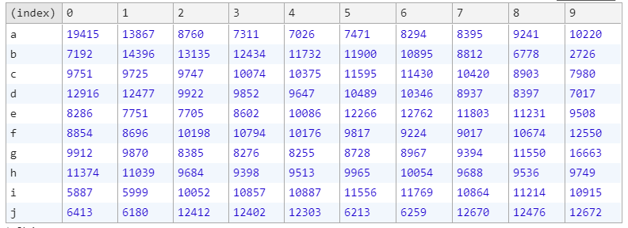

从这个表格中我们能够看出，每个元素在每个位置出现的概率相差很大，比如元素 a ，
在索引0的位置上出现了 19415 次，在索引4 的位置上只出现了 7026 次，
元素 a 在这两个位置出现的次数相差很大（相差一倍还多）。
如果排序真的是随机的，那么每个元素在每个位置出现的概率都应该一样，
实验结果各个位置的数字应该很接近，而不是像现在这样各个位置的数字相差很大。

为什么会有问题呢？这需要从array.sort方法排序底层说起。

v8在处理sort方法时，使用了插入排序和快排两种方案。
当目标数组长度小于10时，使用插入排序；反之，使用快速排序。 

其实不管用什么排序方法，大多数排序算法的时间复杂度介于O(n)到O(n²)之间，
元素之间的比较次数通常情况下要远小于n(n-1)/2，
也就意味着有一些元素之间根本就没机会相比较（也就没有了随机交换的可能），
这些 sort 随机排序的算法自然也不能真正随机。


其实我们想使用array.sort进行乱序，理想的方案或者说纯乱序的方案是数组中每两个元素都要进行比较，
这个比较有50%的交换位置概率。这样一来，总共比较次数一定为n(n-1)。
而在sort排序算法中，大多数情况都不会满足这样的条件。因而当然不是完全随机的结果了。


## 从插入排序来看 sort 的不完全比较

一段简单的插入排序代码：
```javascript
function insertSort(list = []) {
    for(let i = 1 , len = list.length; i < len; i++){
        let j = i - 1;
        let temp = list[ i ];
        while (j >= 0 && list[ j ] > temp){
            list[j + 1] = list[ j ];
            j = j - 1;
        }
        list[j + 1] = temp;
    }
    return list;
}
```
其原理在于将第一个元素视为有序序列，遍历数组，将之后的元素依次插入这个构建的有序序列中。

我们来个简单的示意图：

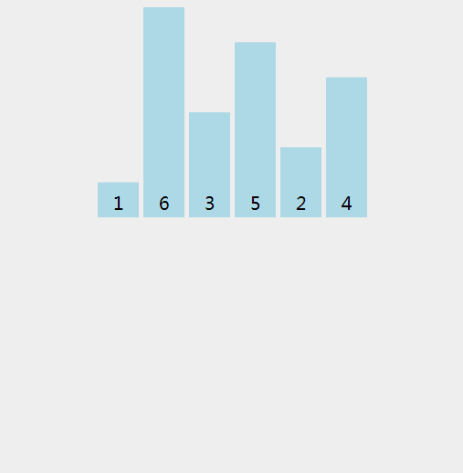

我们来具体分析下 ['a', 'b', 'c'] 这个数组乱序的结果，需要注意的是，由于数组长度小于10，所以 sort 函数内部是使用插入排序实现的。

演示代码为：

```javascript
var values = ['a', 'b', 'c'];

values.sort(function(){
    return Math.random() - 0.5;
});
```

详细分析如下：

由于插入排序将第一个元素视为有序的，所以数组的外层循环从 i = 1 开始。此时比较 a 和 b
，因为 Math.random() - 0.5 的结果有 50% 的概率小于 0 ，有 50% 的概率大于 0，所以有 50% 的概率数组变成 ['b','a','c']，50% 的结果不变，数组依然为 ['a','b','c']。

假设依然是 ['a','b','c']，我们再进行一次分析，接着遍历，i = 2，比较 b 和 c：

有 50% 的概率数组不变，依然是 ['a','b','c']，然后遍历结束。

有 50% 的概率变成 ['a', 'c', 'b']，因为还没有找到 c 正确的位置，所以还会进行遍历，所以在这 50% 的概率中又会进行一次比较，比较 a 和 c，有 50% 的概率不变，数组为 ['a','c','b']，此时遍历结束，有 50% 的概率发生变化，数组变成 ['c','a','b']。

综上，在 ['a','b','c'] 中，有 50% 的概率会变成 ['a','b','c']，有 25% 的概率会变成 ['a','c','b']，有 25% 的概率会变成 ['c', 'a', 'b']。

另外一种情况 ['b','a','c'] 与之分析类似，我们将最终的结果汇总成一个表格：


## 改造 sort 和 Math.random() 的结合方式

我们已然知道 sort 和 Math.random() 来实现数组乱序所存在的问题，
主要是由于缺少每个元素之间的比较，那么我们不妨将数组元素改造一下，
将其改造为一个对象。
```javascript
let arr = [
    {
        val:'a',
        ram:Math.random()
    },
    {
        val:'b',
        ram:Math.random()
    }
    //...
]
```
我们将数组中原来的值保存在对象的 val 属性中，同时为对象增加一个属性 ram ，值为一个随机数。

接下来我们只需要对数组中每个对象的随机数进行排序，即可得到一个乱序数组。

代码如下：
```javascript
function shuffle(arr) {
    let newArr = arr.map(item=>({val:item,ram:Math.random()}));
    newArr.sort((a,b)=>a.ram-b.ram);
    arr.splice(0,arr.length,...newArr.map(i=>i.val));
    return arr;
}
```

将 shuffle 方法应用于我们之前实现的验证函数 test_shuffle 中
```javascript
test_shuffle(shuffle)
```
结果如下：

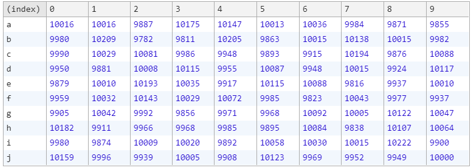

从表格中我们可以看出，每个元素在每个位置出现的次数已经相差不大。

虽然已经满足了随机性的要求，但是这种实现方式在性能上并不好，需要遍历几次数组，并且还要对数组进行 splice 操作。

那么如何高性能的实现真正的乱序呢？而这就要提到经典的 Fisher–Yates 算法。

## Fisher–Yates

为什么叫 Fisher–Yates 呢？ 因为这个算法是由 Ronald Fisher 和 Frank Yates 首次提出的。

这个算法其实非常的简单，就是将数组从后向前遍历，然后将当前元素与随机位置的元素进行交换。结合图片来解释一下：

首先我们有一个已经排好序的数组

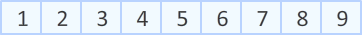

Step1： 第一步需要做的就是，从数组末尾开始，选取最后一个元素。

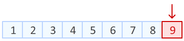

在数组一共9个位置中，随机产生一个位置，该位置元素与最后一个元素进行交换。

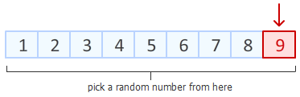

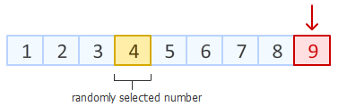

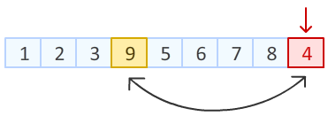

Step2： 上一步中，我们已经把数组末尾元素进行随机置换。
接下来，对数组倒数第二个元素动手。
在除去已经排好的最后一个元素位置以外的8个位置中，
随机产生一个位置，该位置元素与倒数第二个元素进行交换。

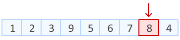

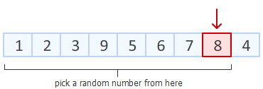

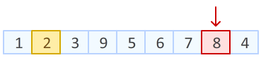

Step3： 理解了前两步，接下来就是依次进行，如此简单。

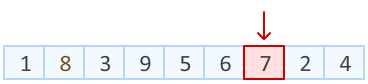


接下来我们用代码来实现一下 Fisher–Yates
```javascript
function shuffle(arr) {
    let m = arr.length;
    while (m){
        let index = Math.floor(Math.random() * m--);
        let cur = arr[m];
        arr[m] = arr[index];
        arr[index] = cur;
    }
    return arr;
}
```

接着我们再用之前的验证函数 test_shuffle 中 

```javascript
test_shuffle(shuffle);
```

结果如下： 

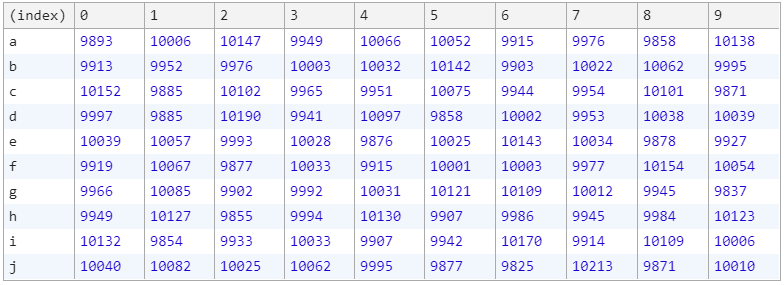

从表格中我们可以看出，每个元素在每个位置出现的次数相差不大，说明这种方式满足了随机性的要求。

而且 Fisher–Yates 算法只需要通过一次遍历即可将数组随机打乱顺序，性能极为优异~~

至此，我们找到了将数组乱序操作的最优办法：Fisher–Yates~

## 参考

+ [如何在Javascript中正确的打乱数组](https://medium.com/@nitinpatel_20236/how-to-shuffle-correctly-shuffle-an-array-in-javascript-15ea3f84bfb)
+ [JavaScript专题之乱序](https://github.com/mqyqingfeng/Blog/issues/51)
