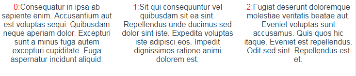
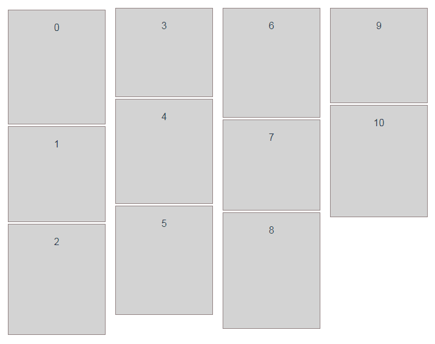
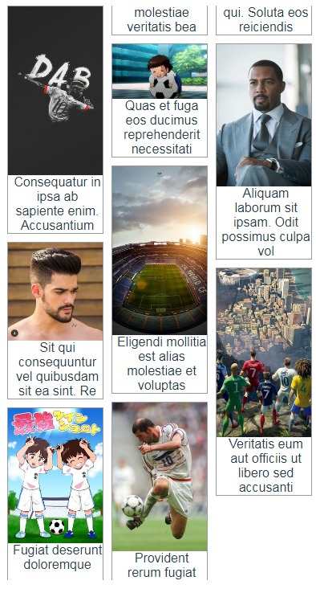
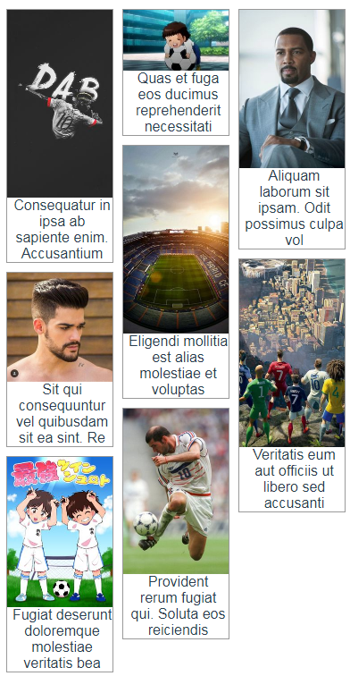

# 瀑布流与木桶布局

> 你知道的越多，你不知道的越多  
> 点赞再看，养成习惯

## 前言

2019年终岁尾，最近对布局相关的内容比较有兴趣，在此整理一下和瀑布流相关的使用场景以及多种实现方案。

本文主要分为2部分：

1. 瀑布流布局
2. 木桶布局

## 瀑布流布局

`瀑布流`又称瀑布流式布局，是一种比较流行的页面布局方式，专业的英文名称为[`Masonry Layouts`]。与传统的分页显示不同，视觉表现为`参差不齐`的多栏布局，最早是由[Pinterest](https://www.pinterest.com/)首先运用。

无图无真相：


如图所示，网页上呈现`参差不齐`的多栏布局，图片`等宽不等高`，根据图片原比例缩放直至宽度达到固定的要求，每行排满后，后面的元素依次添加到其后，视觉上显得错落有致不拘一格。

### 瀑布流的优点

优点如下：

+ 节省空间，外表美观，更有艺术性。
+ 对于触屏设备非常友好，通过向上滑动浏览
+ 用户浏览时的观赏和思维不容易被打断，留存更容易。

> 从体验的心理讲，女性是一种逛街数小时都不需要停歇的生物，一眼望不到头的瀑布流契合了这种心理。瀑布流的图片就像商品，就像逛街、就像扫货。女性只要不断往下拉伸页面，就像置身在一条没有尽头的购物街，没有层高限制的商场中一样。传统布局中的下一页就是打断，好比男朋友轻声在耳边说了句：休息一下吧，我累了……结果不言而喻~

### 瀑布流的缺点

缺点如下：

+ 用户无法了解内容总长度，对内容没有宏观掌控。
+ 用户无法了解现在所处的具体位置，不知道离终点还有多远。
+ 回溯时不容易定位到之前看到的内容。
+ 容易造成页面加载的负荷。
+ 容易造成用户浏览的疲劳，没有短暂的休息时间。

### 瀑布流的适用场景

根据瀑布流的优缺点，我们不难得出在什么情况下选择瀑布流是合理的选择：

+ `内容以图片为主的时候`，瀑布流是更好的选择。图片占用空间比较大，并且大脑理解的速度相比理解文字要快，短时间内可以扫过的内容很多，所以如果用分页显示的话用户务必会频繁的翻页，影响沉浸式的体验，而瀑布流可以解决这个问题。

+ `信息与信息之间相对独立时`，瀑布流是更好的选择。如果信息关联性强，用户务必会进行大量的回溯操作去查看之前或者之后的信息，相反，如果信息相对独立的话，可以使用瀑布流，让用户同时接受来自不同地方的信息。

+ `信息与搜索匹配比较模糊时`，瀑布流是更好的选择。瀑布流给人的直观印象，就是同时显示的信息与用户搜索的匹配度大致一样，而分页显示的直观印象则是越靠上的信息被认为与用户的搜索越匹配。因此，当信息与搜索匹配度没有明显区分度时，可以采用瀑布流。

+ `用户目的性不强的时候`，瀑布流是更好的选择。如果用户有特定需要查找的信息，分页查找定位更方便，而当目的性较弱的时候，瀑布流可以增加用户停留的时间和意想不到的收获。

### CSS实现瀑布流

为实现瀑布流，我们将DOM结构设计为如下结构

```html
```

### multi-column 多栏布局实现瀑布流

通常`Multi-column`用于文本的分列：

```html
.container {
  column-count: 3;
}
```



`multi-column`布局中子元素的排列顺序是先`从上往下`再`从左至右`。



根据这个特性，我们就可以用来实现`瀑布流`。

`multi-column`实现`瀑布流`主要依赖以下几个属性：

+ `column-count`: 设置共有几列
+ `column-width`: 设置每列宽度，列数由`总宽度`与`每列宽度`计算得出
+ `column-gap`: 设置列与列之间的间距

`column-count`和`column-width`都可以用来定义分栏的数目，而且并没有明确的优先级之分。优先级的计算取决与具体的场景。

计算方式为：计算`column-count`和`column-width`转换后具体的列数，哪个小就用哪个。

一个图片&文字的例子：

```html
<div class="masonry">
    <div class="item">
        
        <span class="title">...</span>
    </div>
    <div class="item">
        
        <span class="title">...</span>
    </div>
    <!-- more items-->
</div>
```

```css
.masonry{
    column-count: 3;
    column-gap: 10px;
}
.masonry .item{
    border:1px solid #999;
    margin-bottom: 10px;
}
.masonry .item img{
    width: 100%;
}
```

[点击查看在线DEMO及完整代码](https://codesandbox.io/s/masonry-column-1-ddbhw)

效果如下：



我们可以看到，虽然实现了`瀑布流`的效果，但奇怪的是例子中前两列的最后一个元素的`文本内容`被`自动断开`，一部分在当前列尾，一部分在下一列的列头。

我的理解是`multi-column`布局会将其内的元素自动进行流动和平衡，尽可能保证每列的高度趋于相同，所以会将其内的文本阶段分布在两列内。

而这种展示方式无疑是我们不希望看到的，我们希望的是每个元素都是独立的，前后不断开，此时我们需要使用`break-inside`来实现。

break-inside: auto | avoid

+ auto: 元素可以中断
+ avoid: 元素不能中断

修改一下之前的例子：

```css
.masonry .item{
    break-inside: avoid;
}
```

[点击查看在线DEMO及完整代码](https://codesandbox.io/s/masonry-column-2-lekzq)

效果如下：



效果实现了，但由于`multi-column`布局中子元素的排列顺序是先`从上往下`再`从左至右`，所以这种方式仅适用于数据固定不变的情况，对于滚动加载更多等可动态添加数据的情况就并不适用了。

> 关于`column`更多的用法，参见[MDN](https://developer.mozilla.org/zh-CN/docs/Web/CSS/columns)   
> 关于`column`的兼容性，参见[caniuse](https://www.caniuse.com/#search=columns)

### grid 布局实现瀑布流

### JS实现瀑布流


## 木桶布局

什么是木桶布局，我们随便百度一张图片就知道了。如下图。


## 何时应用瀑布流

做瀑布流需要考虑几方面大因素，图片质量，图片大小，加载速度，如果这些不能同时满足，会大大降低用户体验。

浏览行为缺乏特别明确的目的性，以“逛逛”“扫街”的心态为主
对复杂的信息索引无依赖性
用户以图片为首要检索对象，瀑布流页面的配文只是相当次要的辅助信息
竖图比例较高
图片平均质量较高
图片的风格气质趋于相似（也是Pinterest始终采取邀请制的原因）


它们从左到右，然后从上到下排序。第一个块位于每列的顶部，而后面的块位于最短的列中。（即，无论列如何，该块都应尽可能高地放置在页面的上方）

## API 参考


## 总结

做瀑布流需要考虑几方面大因素，图片质量，图片大小，加载速度，如果这些不能同时满足，会大大降低用户体验。个人觉得瀑布流对于触屏终端体验会更好一些。

## 参考

+ [瀑布流的设计体验真的很好吗？](https://www.zhihu.com/question/20005422/answers/updated)
+ 


