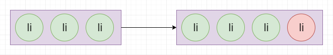
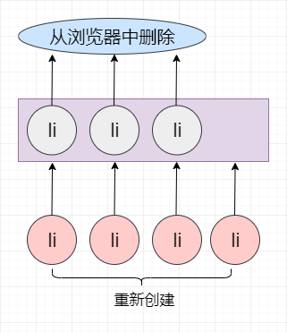
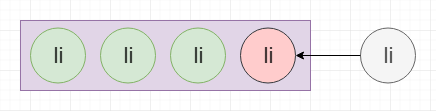
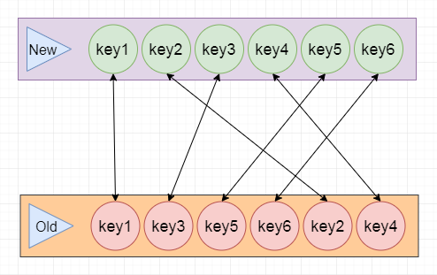

# 虚拟DOM之更新子节点（一）

## 回顾

在对比子节点差异的时候，我们需要区分新旧子节点的不同情况：

+ 旧:单个子节点 && 新：单个子节点
+ 旧:单个子节点 && 新：没有子节点
+ 旧:单个子节点 && 新：多个子节点
+ 旧:没有子节点 && 新：单个子节点
+ 旧:没有子节点 && 新：没有子节点
+ 旧:没有子节点 && 新：多个子节点
+ 旧:多个子节点 && 新：单个子节点
+ 旧:多个子节点 && 新：没有子节点

这8中情况，都非常简单，就不过多论述了。

再先看一下，我们之前是怎么操作新旧节点均为多个子节点的情况的：

遍历旧的子节点，将其全部移除:

```javascript
for (let i = 0; i < prevChildren.length; i++) {
    removeChild(container,prevChildren[i].el)
}
```

遍历新的子节点，将其全部挂载

```javascript
for (let i = 0; i < nextChildren.length; i++) {
    mount(nextChildren[i], container)
}
```

在浏览器中操作DOM是极为昂贵的，这种操作方式需要不停的对DOM进行删除和创建的操作，但是对于新旧节点差异很小的情况下，无法尽可能的复用原有DOM节点，从而造成性能上的浪费。

看一个简单的例子：


按照之前的逻辑，原有子节点删除，重新创建所有的新子节点，无疑会造成性能上的巨大浪费。



我们真正想做的，其实是找出二者之间的区别，针对二者的不同进行修改。




找出新旧子节点的不同，并针对不同之处进行更新的过程，其实就是我们常说的核心Diff算法。

## React/Vue中的key

Vue对于Key的说明：

> key 的特殊属性主要用在 Vue 的虚拟 DOM 算法，在新旧 nodes 对比时辨识 VNodes。

React对于Key的说明：

> 当子元素拥有 key 时，React 使用 key 来匹配原有树上的子元素以及最新树上的子元素。

总结

>新子节点根据自己的key找到对应的旧子节点。



通过key来查找新旧子节点的对应关系其实很好理解，但不论是React还是Vue，都支持不传递Key的使用方式，那么这种方式，新旧子节点如何查找对应关系的呢？

## 无Key的Diff

