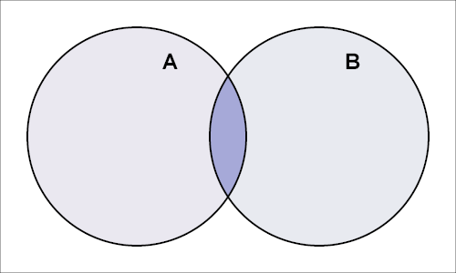
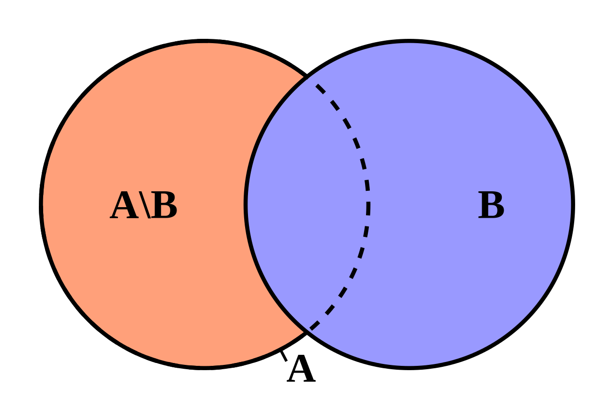

# 数组的交集并集差集

## 什么是交集、并集、差集

交集、并集、差集属于集合论中的数学概念，我们先来简单看一下他们的基本定义。

### 交集

集合论中，设A，B是两个集合，由所有属于集合A且属于集合B的元素所组成的集合，
叫做集合A与集合B的交集（intersection），记作A∩B。



### 并集

集合论中，设A，B是两个集合，把他们所有的元素合并在一起组成的集合，
叫做集合A与集合B的并集（union），记作A∪B


### 差集

集合论中，设A，B是两个集合，则所有属于A但不属于B的元素组成的集合,
叫做集合A和集合B的差集（difference），记做A-B或A\B




## 方法实现

### 使用 indexOf 判断包含关系
```javascript
const intersection = function(A = [],B = []) {
    return A.filter(i=>B.indexOf(i)>=0);
}

const union = function(A=[],B=[]){
    return A.concat(B.filter(i=>A.indexOf(i) === -1));
}

const difference = function(A=[],B=[]) {
    return A.filter(i=>B.indexOf(i) === -1);
}
```

上面的方法，简单的实现了数组的交集并集和差集，但是由于 indexOf 方法在检索 NaN 元素时永远都返回 -1，
所以通过 indexOf 方法实现的交集并集差集，并不适用于存在 NaN 的情况。

对于集合来说，集合中的元素是不可重复的，上面的方法，并没有对数组中的重复元素进行去重，
如果从严格上来说，使用上面的方法后，还需要进行数组去重的操作。

### 使用 includes 判断包含关系
```javascript
const intersection = function(A = [],B = []) {
    return A.filter(i=>B.includes(i));
}

const union = function(A=[],B=[]){
    return A.concat(B.filter(i=>!A.includes(i)));
}

const difference = function(A=[],B=[]) {
    return A.filter(i=>!B.includes(i));
}
```
上面的方法使用 includes 方法来判断元素是否存在，结局了 indexOf 方法无法正确判断 NaN 元素的问题，
但严格来说，还需要额外的对数组进行去重操作，依然并不完美。

### 使用 Set 
```javascript
const union = function(A=[],B=[]){
    return [...new Set([...A,...B])]
}

const intersection = function(A = [],B = []) {
	return [...new Set(A.filter(i=>new Set(B).has(i)))]
}

const difference = function(A=[],B=[]) {
	return [...new Set(A.filter(i=>!new Set(B).has(i)))]
}
```
由于 Set 对象存储的是唯一值，所以天然的具有去重的能力。
至此，我们完美的实现了数组的交集、并集、差集。


