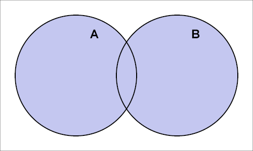

# 数组的交集并集补集

## 什么是交集、并集、补集

交集、并集、差集属于集合论中的数学概念，我们先来简单看一下他们的基本定义。

### 交集

集合论中，设A，B是两个集合，由所有属于集合A且属于集合B的元素所组成的集合，
叫做集合A与集合B的交集（intersection），记作A∩B。

### 并集

集合论中，设A，B是两个集合，把他们所有的元素合并在一起组成的集合，
叫做集合A与集合B的并集（union），记作A∪B

### 补集

集合论中，设A，B是两个集合，则所有属于A但不属于B的元素组成的集合,
叫做集合B在集合A中的补集（complement），记做A-B或A\B

