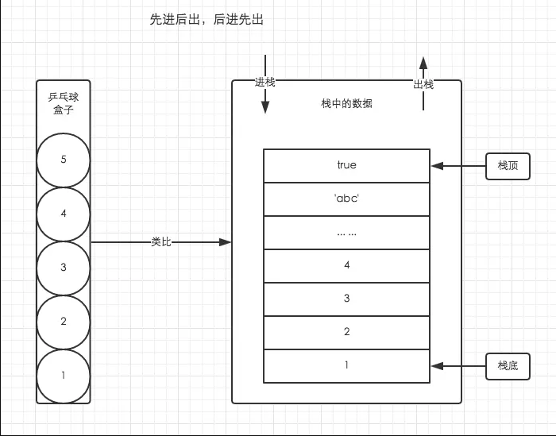
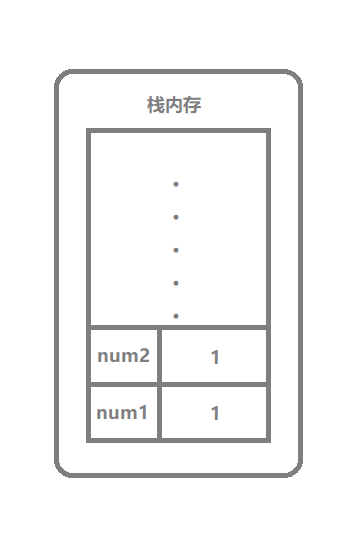
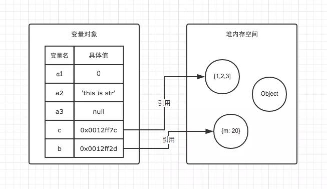
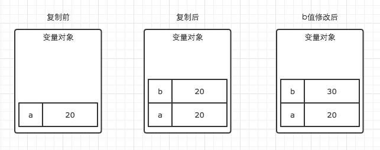
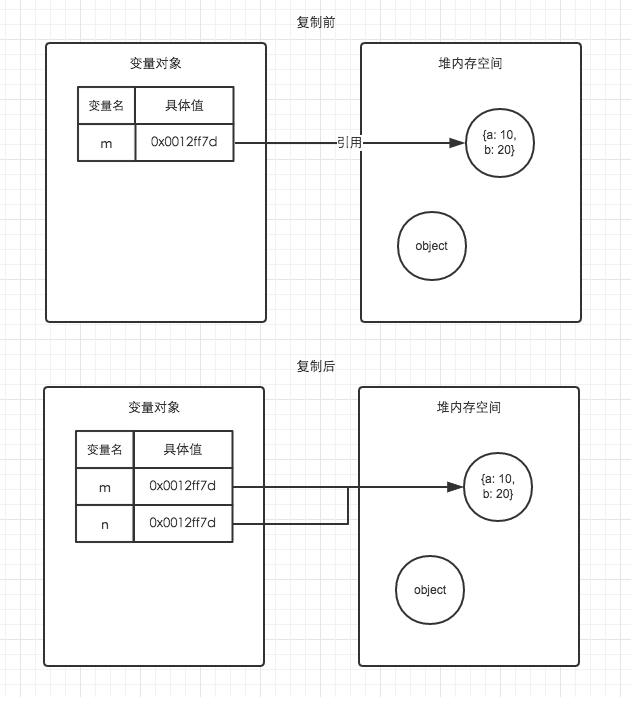

# JS中的栈内存和堆内存

## 引言
JS的内存空间分为栈(stack)、堆(heap)、池(一般也会归类为栈中)。 
其中栈存放变量，堆存放复杂对象，池存放常量，所以也叫常量池。

## 栈数据结构
栈是一种特殊的列表，栈内的元素只能通过列表的一端访问，这一端称为栈顶。
栈被称为是一种后入先出（LIFO，last-in-first-out）的数据结构。
由于栈具有后入先出的特点，所以任何不在栈顶的元素都无法访问。
为了得到栈底的元素，必须先拿掉上面的元素。

在这里，为方便理解，通过类比乒乓球盒子来分析栈的存取方式。



这种乒乓球的存放方式与栈中存取数据的方式如出一辙。
处于盒子中最顶层的乒乓球 5，它一定是最后被放进去，但可以最先被使用。
而我们想要使用底层的乒乓球 1，就必须将上面的 4 个乒乓球取出来，让乒乓球1处于盒子顶层。
这就是栈空间先进后出，后进先出的特点。

## 堆数据结构
堆数据结构是一种树状结构。它的存取数据的方式与书架和书非常相似。
我们只需要知道书的名字就可以直接取出书了，并不需要把上面的书取出来。
JSON格式的数据中，我们存储的key-value可以是无序的，
因为顺序的不同并不影响我们的使用，我们只需要关心书的名字。

## 变量类型与内存的关系

### 基本数据类型
基本数据类型共有6种：
1. Sting
2. Number
3. Boolean
4. null
5. undefined
6. Symbol

基本数据类型保存在栈内存中，
因为基本数据类型占用空间小、大小固定，通过按值来访问，属于被频繁使用的数据。

为了更好的搞懂基本数据类型变量与栈内存，我们结合以下例子与图解进行理解：
```javascript
let num1 = 1;
let num2 = 1;
```


PS: 需要注意的是闭包中的基本数据类型变量不保存在栈内存中，而是保存在堆内存中。这个问题，我们后文再说。
https://github.com/yygmind/blog/issues/15

### 引用数据类型
Array,Function,Object...可以认为除了上文提到的基本数据类型以外，所有类型都是引用数据类型。


引用数据类型存储在堆内存中，因为引用数据类型占据空间大、大小不固定。
如果存储在栈中，将会影响程序运行的性能；
引用数据类型在栈中存储了指针，该指针指向堆中该实体的起始地址。
当解释器寻找引用值时，会首先检索其在栈中的地址，取得地址后从堆中获得实体

为了更好的搞懂变量对象与堆内存，我们结合以下例子与图解进行理解。
```javascript
// 基本数据类型-栈内存
let a1 = 0;   
// 基本数据类型-栈内存
let a2 = 'this is string'; 
// 基本数据类型-栈内存
let a3 = null;

// 对象的指针存放在栈内存中，指针指向的对象存放在堆内存中
let b = { m: 20 };
// 数组的指针存放在栈内存中，指针指向的数组存放在堆内存中
let c = [1, 2, 3]; 
```



因此当我们要访问堆内存中的引用数据类型时，实际上我们首先是从变量中获取了该对象的地址指针，
然后再从堆内存中取得我们需要的数据。


## 从内存角度来看变量复制

**基本数据类型的复制**
```javascript
let a = 20;
let b = a;
b = 30;
console.log(a); // 此时a的值是多少，是30？还是20？
```
答案是：20

在这个例子中，a、b 都是基本类型，它们的值是存储在栈内存中的，a、b 分别有各自独立的栈空间，
所以修改了 b 的值以后，a 的值并不会发生变化。

从下图可以清洗的看到变量是如何复制并修改的。




**引用数据类型的复制**

```javascript
let m = { a: 10, b: 20 };
let n = m;
n.a = 15;
console.log(m.a) //此时m.a的值是多少，是10？还是15？
```
答案是：15

在这个例子中，m、n都是引用类型，栈内存中存放地址指向堆内存中的对象，
引用类型的复制会为新的变量自动分配一个新的值保存在变量中，
但只是引用类型的一个地址指针而已，实际指向的是同一个对象，
所以修改 n.a 的值后，相应的 m.a 也就发生了改变。

从下图可以清洗的看到变量是如何复制并修改的。



## 栈内存和堆内存的优缺点

在JS中，基本数据类型变量大小固定，并且操作简单容易，所以把它们放入栈中存储。
引用类型变量大小不固定，所以把它们分配给堆中，让他们申请空间的时候自己确定大小，这样把它们分开存储能够使得程序运行起来占用的内存最小。

栈内存由于它的特点，所以它的系统效率较高。
堆内存需要分配空间和地址，还要把地址存到栈中，所以效率低于栈。


## 栈内存和堆内存的垃圾回收
栈内存中基本型一般在它的当前执行环境结束就会被销毁被垃圾回收制回收，
而引用类型不会，因为不确定其他的地方是不是还有一些对它的引用，
所以引用型只有在所有对它的引用都结束的时候才会被回收掉。

[关于垃圾回收详细内容参见另一篇文章(外链暂缺)]()


