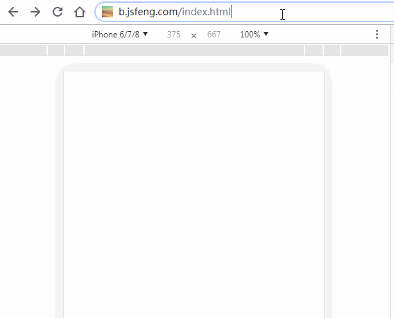
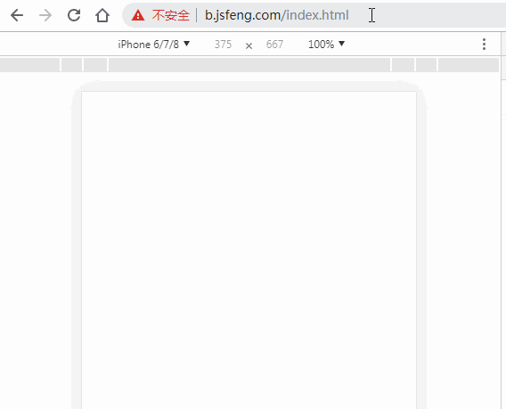

# 单页路由解析与实现


## 前言

现代前端项目多为单页Web应用(SPA)，在单页Web应用中路由是其中的重要环节。

每个现代前端框架都有与之对应的路由实现，例如 vue-router、react-router 等。

本文并不涉及 vue-router、react-router 的实现方式，而是介绍前端路由的基本实现原理及实现方式。

vue-router、react-router 的源码解析，会在以后的文章中逐步推出。


## 什么是 SPA

SPA 是 single page web application 的简称，译为单页Web应用。

简单的说 SPA 就是只有一个WEB项目只有一个 HTML 页面，一旦页面加载完成，SPA 不会因为用户的操作而进行页面的重新加载或跳转。
取而代之的是利用 JS 动态的变换 HTML 的内容，从而来模拟多页面间的跳转。


## 前端路由的由来

最开始的网页是多页面的，直到 Ajax 的出现，才慢慢有了 SPA。

SPA 的出现大大提高了 WEB 应用的交互体验。在与用户的交互过程中，不再需要重新刷新页面，获取数据也是通过 Ajax 异步获取，页面显示变的更加流畅。

但由于 SPA 中用户的交互是通过 JS 改变 HTML 内容来实现的，页面本身的 url 并没有变化，这导致了两个问题：

1. SPA 无法记住用户的操作记录，无论是刷新、前进还是后退，都无法展示用户真实的期望内容。
2. SPA 中虽然由于业务的不同会有多种页面展示形式，但只有一个 url，对 SEO 不友好，不方便搜索引擎进行收录。

前端路由就是为了解决上述问题而出现的。


## 什么是前端路由

简单的说，就是在保证只有一个 HTML 页面，且与用户交互时不刷新和跳转页面的同时，为 SPA 中的每种页面展示形式匹配一个特殊的 url。在刷新、前进、后退和SEO时均通过这个特殊的 url 来实现。

为实现这一目标，我们需要做到以下二点：

1. 改变 url 且不让浏览器像服务器发送请求。
2. 可以监听到 url 的变化

接下来要介绍的 hash 模式和 history 模式，就是实现了上面的功能

## hash 模式

这里的 hash 就是指 url 后的 # 号以及后面的字符。比如说 "http://www.baidu.com/#hashhash" ，其中 "#hashhash" 就是我们期望的 hash 值。

由于 hash 值的变化不会导致浏览器像服务器发送请求，而且 hash 的改变会触发 hashchange 事件，浏览器的前进后退也能对其进行控制，所以在 H5 的 history 模式出现之前，基本都是使用 hash 模式来实现前端路由。

**使用到的API:**

```javascript
window.location.hash = 'hash字符串'; // 用于设置 hash 值

let hash = window.location.hash; // 获取当前 hash 值

// 监听hash变化，点击浏览器的前进后退会触发
window.addEventListener('hashchange', function(event){ 
    let newURL = event.newURL; // hash 改变后的新 url
    let oldURL = event.oldURL; // hash 改变前的旧 url
})
```

**接下来我们来实现一个路由对象**


创建一个路由对象, 实现 register 方法用于注册每个 hash 值对应的回调函数

```javascript
class HashRouter{
    constructor(){
        //用于存储不同hash值对应的回调函数
        this.routers = {};
    }
    //用于注册每个页面
    register(url,callback = function(){}){
        this.routers[url] = callback;
    }
}
```

不存在hash值时，认为是首页，所以实现 registerIndex 方法用于注册首页时的回调函数

```javascript
class HashRouter{
    constructor(){
        //用于存储不同hash值对应的回调函数
        this.routers = {};
    }
    //用于注册每个页面
    register(url,callback = ()=>{}){
        this.routers[url] = callback;
    }
    //用于注册首页
    registerIndex(callback = ()=>{}){
        this.routers['index'] = callback;
    }
}
```

通过 hashchange 监听 hash 变化，并定义 hash 变化时的回调函数

```javascript
class HashRouter{
    constructor(){
        //用于存储不同hash值对应的回调函数
        this.routers = {};
        window.addEventListener('hashchange',this.load.bind(this),false)
    }
    //用于注册每个页面
    register(url,callback = function(){}){
        this.routers[url] = callback;
    }
    //用于注册首页
    registerIndex(callback = ()=>{}){
        this.routers['index'] = callback;
    }
    //用于调用不同页面的回调函数
    load(){
        let hash = location.hash.slice(1),
            handler;
        //没有hash 默认为首页
        if(!hash){
            handler = this.routers.index;
        }else{
            handler = this.routers[hash];
        }
        //执行注册的回调函数
        handler();
    }
}
```

我们做一个例子来演示一下我们刚刚完成的 HashRouter

```html
<body>
    <div id="nav">
        <a href="#/page1">page1</a>
        <a href="#/page2">page2</a>
        <a href="#/page3">page3</a>
    </div>
    <div id="container"></div>
</body>
```

```javascript
let router = new HashRouter();
let container = document.getElementById('container');

//注册首页回调函数
router.registerIndex(()=> container.innerHTML = '我是首页');

//注册其他页面回到函数
router.register('/page1',()=> container.innerHTML = '我是page1');
router.register('/page2',()=> container.innerHTML = '我是page2');
router.register('/page3',()=> container.innerHTML = '我是page3');

//加载页面
router.load();
```

我们来看一下效果：



基本的路由功能我们已经实现了，但依然有点小问题

1. 页面切换后，新的 hash 值没有在路由中注册  
2. hash 值对应的回调函数在执行过程中抛出异常

对应的解决办法如下：

1. 我们追加 registerNotFound 方法，用于注册 hash 值为找到时的默认回调函数；
2. 修改 load 方法，追加 try/catch 用于捕获异常，追加 registerError 方法，用于处理异常

代码修改后：

```javascript
class HashRouter{
    constructor(){
        //用于存储不同hash值对应的回调函数
        this.routers = {};
        window.addEventListener('hashchange',this.load.bind(this),false)
    }
    //用于注册每个页面
    register(url,callback = function(){}){
        this.routers[url] = callback;
    }
    //用于注册首页
    registerIndex(callback = ()=>{}){
        this.routers['index'] = callback;
    }
    registerNotFound(callback = ()=>{}){
        this.routers['404'] = callback;
    }
    //用于处理异常情况
    registerError(callback = ()=>{}){
        this.routers['error'] = callback;
    }
    //用于调用不同页面的回调函数
    load(){
        let hash = location.hash.slice(1),
            handler;
        //没有hash 默认为首页
        if(!hash){
            handler = this.routers.index;
        }
        //未找到对应hash值
        else if(!this.routers.hasOwnProperty(hash)){
            handler = this.routers['404'] || function(){};
        }
        else{
            handler = this.routers[hash]
        }
        //执行注册的回调函数
        try{
            handler();
        }catch(e){
            console.error(e);
            (this.routers['error'] || function(){})(e);
        }
    }
}
```

再来一个例子，演示一下：

```html
<body>
    <div id="nav">
        <a href="#/page1">page1</a>
        <a href="#/page2">page2</a>
        <a href="#/page3">page3</a>
        <a href="#/page4">page4</a>
        <a href="#/page5">page5</a>
    </div>
    <div id="container"></div>
</body>
```

```javascript
let router = new HashRouter();
let container = document.getElementById('container');

//注册首页回调函数
router.registerIndex(()=> container.innerHTML = '我是首页');

//注册其他页面回到函数
router.register('/page1',()=> container.innerHTML = '我是page1');
router.register('/page2',()=> container.innerHTML = '我是page2');
router.register('/page3',()=> container.innerHTML = '我是page3');
router.register('/page4',()=> {throw new Error('抛出一个异常')});

//加载页面
router.load();
//注册未找到对应hash值时的回调
router.registerNotFound(()=>container.innerHTML = '页面未找到');
//注册出现异常时的回调
router.registerError((e)=>container.innerHTML = '页面异常，错误消息：<br>' + e.message);
```

我们来看一下效果：



至此，基于 hash 方式实现的前端路由，我们已经将基本雏形实现完成了，当然，它与 vue-router、react-router 相比还太过简陋，但它们的内部实现原理和我们现在的实现原理是相同的。

接下来我们来介绍前端路由的另一种模式：history 模式。

## history 模式

在 HTML5 之前，浏览器就已经有了 history 对象。但在早期的 history 中只能用于多页面的跳转：

```javascript
history.go(-1);       // 后退一页
history.go(2);        // 前进两页
history.forward();     // 前进一页
history.back();      // 后退一页
```

在 HTML5 的规范中，history 新增了以下几个 API：

```javascript
history.pushState();         // 添加新的状态到历史状态栈
history.replaceState();      // 用新的状态代替当前状态
history.state                // 返回当前状态对象
```

来自[MDN](https://developer.mozilla.org/zh-CN/docs/Web/API/History_API)的解释：

> HTML5引入了 history.pushState() 和 history.replaceState() 方法，它们分别可以添加和修改历史记录条目。这些方法通常与window.onpopstate 配合使用。

history.pushState() 和 history.replaceState() 均接收三个参数（state, title, url）

参数说明如下：

1. state：合法的 Javascript 对象，可以用在 popstate 事件中
2. title：现在大多浏览器忽略这个参数，可以直接用 null 代替
3. url：任意有效的 URL，用于更新浏览器的地址栏

history.pushState() 和 history.replaceState() 的区别在于：

+. history.pushState() 在保留现有历史记录的同时，将 url 加入到历史记录中。
+. history.replaceState() 会将历史记录中的当前页面历史替换为 url。

由于 history.pushState() 和 history.replaceState() 可以改变 url 同时，不会刷新页面，所以在 HTML5 中的 histroy 具备了实现前端路由的能力。

回想我们之前完成的 hash 模式，当 hash 变化时，可以通过 hashchange 进行监听。
而 history 的改变并不会触发任何事件，所以我们无法直接监听 history 的改变而做出相应的改变。

所以，我们需要换个思路，我们可以罗列出所有可能触发 history 改变的情况，并且将这些方式一一进行拦截，变相地监听 history 的改变。

对于单页应用的 history 模式而言，url 的改变只能由下面四种方式引起：

1. 点击浏览器的前进或后退按钮
2. 点击 a 标签
3. 在 JS 代码中触发 history.pushState 函数
4. 在 JS 代码中触发 history.replaceState 函数

**思路已经有了，接下来我们来实现一个路由对象**

## hash、history 如何抉择 

已经有 hash 模式了，而且 hash 能兼容到IE8， history 只能兼容到 IE10，为什么还要搞个 history 呢？
首先，hash 本来是拿来做页面定位的，如果拿来做路由的话，原来的锚点功能就不能用了。其次，hash 的传参是基于 url 的，如果要传递复杂的数据，会有体积的限制，而 history 模式不仅可以在url里放参数，还可以将数据存放在一个特定的对象中。


hash 锚点功能失效
hash 兼容性更好，兼容到ie8
hash 看起来更丑

history 需要服务端配合
history 兼容性不好，只能高版本浏览器
history 看起来更美观


