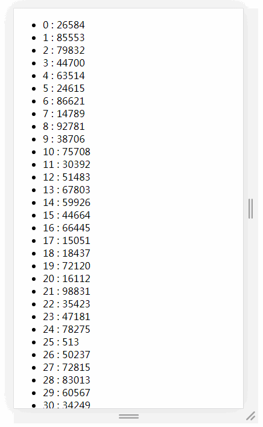

# 如何渲染几万条数据并不卡住界面

## 前言
在实际工作中，我们很少会遇到一次性需要向页面中插入数十万条数据的情况，但是为了丰富我们的知识体系，我们有必要了解并清楚当遇到大量数据时，如何才能在不卡主页面的情况下渲染数据，以及其中背后的原理。

## 最粗暴的做法（一次性渲染）

```html
<ul></ul>
```
```javascript
let now = Date.now();
// 插入十万条数据
const total = 100000;
let ul = document.querySelector('ul');
for (let i = 0; i < total; i++) {
    let li = document.createElement('li');
    li.innerText = Math.floor(Math.random() * total)
    ul.appendChild(li);
}
console.log('JS运行时间：',Date.now() - now);
setTimeout(()=>{
  console.log('总运行时间：',Date.now() - now);
},0)
// print: JS运行时间： 187
// print: 总运行时间： 2844
```

我们对二十万条记录进行循环操作，JS的运行时间为187ms，还是蛮快的，但是最终渲染完成后的总时间确是2844ms

我们可以得出结论，对于大量数据渲染的时候，JS运算并不是性能的瓶颈，性能的瓶颈主要在于渲染阶段

**PS：简单解释一下，为何上面的代码，两次 console.log 的结果时间差异巨大**
+ 在 JS 的 Event Loop 中，当JS引擎所管理的执行栈中的事件以及所有微任务事件全部执行完后，才会触发渲染线程对页面进行渲染
+ 第一个 console.log 的触发时间是在页面进行渲染之前，此时得到的间隔时间为JS运行所需要的时间
+ 第二个 console.log 是放到 setTimeout 中的，它的触发时间是在渲染完成，在下一次 Event Loop 中执行的

## 使用定时器分批渲染
从上面的例子，我们已经知道，页面的卡顿是由于同时渲染大量DOM所引起的，所以我们考虑将渲染过程分批进行

在这里，我们使用 setTimeout 来实现分批渲染
```html
<ul></ul>
```
```javascript
/**
* 渲染
* @param start     开始渲染的索引
* @param once      一次渲染多少条
* @param total     剩余多少条需要渲染
*/
function render(dom,start,once,total){
    //获取真正渲染条数，渲染条数小于剩余总数，将渲染条数覆为盖剩余条数
    let curOnce = Math.min(once,total);
    //将渲染
    setTimeout(()=>{
      for(let i = 0; i < curOnce; i++){
        let li = document.createElement('li');
        li.innerText = start + i + ' : ' + Math.floor(Math.random() * total)
        dom.appendChild(li)
      }
    },0)
    //获取剩余条数
    let nextTotal = total - curOnce;
    //获取下次渲染索引
    let nextStart = start + curOnce;
    //进行下次渲染
    if(nextTotal > 0){
      render(dom,nextStart,once,nextTotal);
    }
}

// 插入十万条数据
const total = 100000;
// 一次插入 20 条，如果觉得性能不好就减少
const once = 20;
//需要插入的容器
let ul = document.querySelector('ul');

render(ul,0,once,total)
```
用一个gif图来看一下效果

我们可以看到，页面加载的时间已经非常快了，每次刷新时可以很快的看到第一屏的所有数据

