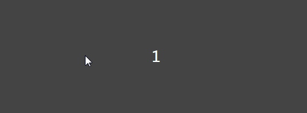

# 节流函数

## 前言 

防抖函数和节流函数本质是不一样的。防抖函数是将多次执行变为最后一次执行，节流函数是将多次执行变成每隔一段时间执行。  

比如说，当当我们做图片懒加载（lazyload）时，需要通过滚动位置，实时显示图片时，如果使用防抖函数，懒加载（lazyload）函数将会不断被延时，
当我们做图片懒加载（lazyload）时，需要通过滚动位置，实时显示图片时，如果使用防抖函数，懒加载（lazyload）函数将会不断被延时，
只有停下来的时候才会被执行，对于这种需要周期性触发事件的情况，防抖函数就显得不是很友好了，此时就应该使用节流函数来实现了。

## 例子
我们依然使用[防抖函数]中的例子来介绍：
```html
<div id="container"></div>
```
```stylus
div{
    height: 200px;
    line-height: 200px;
    text-align: center; color: #fff;
    background-color: #444;
    font-size: 25px;
    border-radius: 3px;
}
```
```javascript 1.8
let count = 1;
let container = document.getElementsByTagName('div')[0];
function updateCount() {
    container.innerHTML = count ++ ;
}
container.addEventListener('mousemove',updateCount);
```
我们来看一下效果：           


我们可以看到，鼠标从左侧滑到右侧，我们绑定的事件执行了119多次

## 节流函数的实现
现在我们来实现一个节流函数，使得鼠标移动过程中每间隔一段时间事件触发一次。
   
### 使用时间戳来实现节流
首先我们想到使用时间戳计时的方式，每次事件执行时获取当前时间并进行比较判断是否执行事件。
```javascript
/**
 * 节流函数
 * @param func 用户传入的节流函数
 * @param wait 间隔的时间
 */
const throttle = function (func,wait = 50) {
    let preTime = 0;
    return function (...args) {
        let now = Date.now();
        if(now - preTime >= wait){
            func.apply(this,args);
            preTime = now;
        }
    }
};
```
```javascript
let count = 1;
let container = document.getElementsByTagName('div')[0];
function updateCount() {
    container.innerHTML = count ++ ;
}
let action = throttle(updateCount,1000);

container.addEventListener('mousemove',action);
```

此时当鼠标移入的时候，事件立即执行，在鼠标移动的过程中，每隔1000ms事件执行一次，旦在最后鼠标停止移动后，事件不会被执行        
此时会有这样的两个问题：
+ 如果我们希望鼠标刚进入的时候不立即触发事件，此时该怎么办呢？
+ 如果我们希望鼠标停止移动后，等到间隔时间到来的时候，事件依然执行，此时该怎么办呢？

### 使用定时器实现节流
为满足上面的需求，我们考虑使用定时器来实现节流函数   
当事件触发的时候，我们设置一个定时器，再触发的时候，定时器存在就不执行，等到定时器执行并执行函数，清空定时器，然后接着设置定时器
```javascript 1.8
/**
 * 节流函数
 * @param func 用户传入的节流函数
 * @param wait 间隔的时间
 */
const throttle = function (func,wait = 50) {
    let timer = null;
    return function (...args) {
        if(!timer){
            timer = setTimeout(()=>{
                func.apply(this,args);
                timer = null;
            },wait);
        }
    }
};
```
使用这个定时器节流函数应用在最开始的例子上：
```javascript 1.8
let action = throttle(updateCount,2000);

container.addEventListener('mousemove',action);
```


我们可以看到，不管我们怎么移动，我们绑定的回调事件都是在鼠标停止后100ms后才会触发。


这是一个简单版的防抖，但是有缺陷，这个防抖只能在最后调用。一般的防抖会有immediate选项，表示是否立即调用。这两者的区别，举个栗子来说：
+ 在搜索引擎搜索问题的时候，我们当然是希望用户输入完最后一个字才调用查询接口，这个时候适用延迟执行的防抖函数，它总是在一连串（间隔小于wait的）函数触发之后调用。
+ 用户在点赞的时候，我们希望用户点第一下的时候就去调用接口，并且成功之后改变star按钮的样子，用户就可以立马得到反馈是否star成功了，这个情况适用立即执行的防抖函数，它总是在第一次调用，并且下一次调用必须与前一次调用的时间间隔大于wait才会触发。

### 立即执行的防抖函数

```javascript 1.8
/**
 * 防抖函数
 * @param func 用户传入的防抖函数
 * @param wait 等待的时间
 * @param immediate 是否立即执行
 */
const debounce = function (func,wait = 50,immediate = false) {
    // 缓存一个定时器id
    let timer = null;
    // 这里返回的函数时每次用户实际调用的防抖函数
    return function(...args){
        // 如果已经设定过定时器了就清空上一次的定时器
        if(timer) clearTimeout(timer);
        if(immediate){
            let callNow = !timer;
            //等待wait的时间间隔后，timer为null的时候，函数才可以继续执行
            timer = setTimeout(()=>{
                timer = null;
            },wait);
            //未执行过，执行
            if(callNow) func.apply(this,args);
        }else{
            // 开始一个定时器，延迟执行用户传入的方法
            timer = setTimeout(()=>{
                //将实际的this和参数传入用户实际调用的函数
                func.apply(this,args);
            },wait);
        }
    }
};
```


### 返回值
此时要注意，用户传入的函数可能是有返回值的，但是当immediate为false的时候，因为使用了setTimeout，函数的返回值永远为undefined,所以我们只在immediate为true的时候返回函数的返回值
```javascript 1.8
/**
 * 防抖函数
 * @param func 用户传入的防抖函数
 * @param wait 等待的时间
 * @param immediate 是否立即执行
 */
const debounce = function (func,wait = 50,immediate = false) {
    // 缓存一个定时器id
    let timer = null;
    let result;
    // 这里返回的函数时每次用户实际调用的防抖函数
    return function(...args){
        // 如果已经设定过定时器了就清空上一次的定时器
        if(timer) clearTimeout(timer);
        if(immediate){
            let callNow = !timer;
            //等待wait的时间间隔后，timer为null的时候，函数才可以继续执行
            timer = setTimeout(()=>{
                timer = null;
            },wait);
            //未执行过，执行
            if(callNow) result = func.apply(this,args);
        }else{
            // 开始一个定时器，延迟执行用户传入的方法
            timer = setTimeout(()=>{
                //将实际的this和参数传入用户实际调用的函数
                func.apply(this,args);
            },wait);
        }
        return result;
    }
};
```

### 取消
最后我们再思考一个小需求，我希望能取消 debounce 函数，比如说我 debounce 的时间间隔是 10 秒钟，immediate 为 true，这样的话，我只有等 10 秒后才能重新触发事件，现在我希望有一个按钮，点击后，取消防抖，这样我再去触发，就可以又立刻执行啦

```javascript 1.8
/**
 * 防抖函数
 * @param func 用户传入的防抖函数
 * @param wait 等待的时间
 * @param immediate 是否立即执行
 */
const debounce = function (func,wait = 50,immediate = false) {
    // 缓存一个定时器id
    let timer = null;
    let result;
    let debounced = function (...args) {
        // 如果已经设定过定时器了就清空上一次的定时器
        if(timer) clearTimeout(timer);
        if(immediate){
            let callNow = !timer;
            //等待wait的时间间隔后，timer为null的时候，函数才可以继续执行
            timer = setTimeout(()=>{
                timer = null;
            },wait);
            //未执行过，执行
            if(callNow) result = func.apply(this,args);
        }else{
            // 开始一个定时器，延迟执行用户传入的方法
            timer = setTimeout(()=>{
                //将实际的this和参数传入用户实际调用的函数
                func.apply(this,args);
            },wait);
        }
        return result;
    };
    debounced.cancel = function(){
        clearTimeout(timer);
        timer = null;
    };
    // 这里返回的函数时每次用户实际调用的防抖函数
    return debounced;
};
```
在原页面的基础上，修改如下
```stylus
div{
    height: 200px;
    line-height: 200px;
    text-align: center; color: #fff;
    background-color: #444;
    font-size: 25px;
    border-radius: 3px;
}
```
```html
<div id="container"></div>
<button id="cancel">点击取消防抖</button>
```
```javascript 1.8
 
let count = 1;
let container = document.getElementsByTagName('div')[0];
let button = document.getElementById('cancel');
function updateCount() {
    container.innerHTML = count ++ ;
}
let action = debounce(updateCount,10000,true);

container.addEventListener('mousemove',action);
button.addEventListener('click',action.cancel);
```

 
至此我们已经完成时限了一个 debounce 函数


+ [博客首页](https://github.com/chenqf/blog)
+ [javascript 基础](https://github.com/chenqf/blog/blob/master/articles/javascript基础)
+ [javascript 进阶](https://github.com/chenqf/blog/blob/master/articles/javascript进阶)
