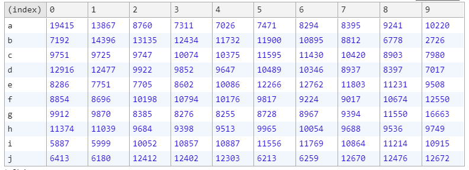
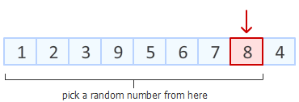

# 随机打乱数组

## 引言

乱序数组指的是：将数组元素的排列顺序随机打乱。

将一个数组进行乱序处理，是一个非常简单但是非常常用的需求。
比如，“猜你喜欢”、“点击换一批”、“中奖方案”等等，都可能应用到这样的处理。

## sort 结合 Math.random

我们首先想到的可能就是 sort 结合 Math.random 方法使用，也就是下面这种实现方式：
```javascript
arr.sort(() => Math.random() - 0.5);
```

相信很多人都使用过这种方式来实现数组乱序，但实际上这种方式是有问题的。
这种方式并不是真正意思上的乱序，一些元素并没有机会相互比较，
最终数组元素停留停留位置的概率并不是完全随机的。

来看一个例子：
```javascript
/**
* 数组乱序
*/
function shuffle(arr) {
  return arr.sort(() => Math.random() - 0.5);
}
```
```javascript
/**
* 用于验证 shuffle 方法是否完全随机
*/
function test_shuffle(shuffleFn) {
  // 多次乱序数组的次数
  let n = 100000; 
  // 保存每个元素在每个位置上出现的次数
  let countObj = {
      a:Array.from({length:10}).fill(0),
      b:Array.from({length:10}).fill(0),
      c:Array.from({length:10}).fill(0),
      d:Array.from({length:10}).fill(0),
      e:Array.from({length:10}).fill(0),
      f:Array.from({length:10}).fill(0),
      g:Array.from({length:10}).fill(0),
      h:Array.from({length:10}).fill(0),
      i:Array.from({length:10}).fill(0),
      j:Array.from({length:10}).fill(0),
  }
  for (let i = 0; i < n; i ++) {
      let arr = ['a', 'b', 'c', 'd', 'e', 'f', 'g', 'h', 'i', 'j'];
      shuffleFn(arr);
      countObj.a[arr.indexOf('a')]++;
      countObj.b[arr.indexOf('b')]++;
      countObj.c[arr.indexOf('c')]++;
      countObj.d[arr.indexOf('d')]++;
      countObj.e[arr.indexOf('e')]++;
      countObj.f[arr.indexOf('f')]++;
      countObj.g[arr.indexOf('g')]++;
      countObj.h[arr.indexOf('h')]++;
      countObj.i[arr.indexOf('i')]++;
      countObj.j[arr.indexOf('j')]++;
  }
  console.table(countObj);
}
```
```javascript
//验证 shuffle 方法是否随机
test_shuffle(shuffle)
```
在这个例子中，我们定义了两个函数，shuffle 中使用 sort 和 Math.random() 进行数组乱序操作；
test_shuffle 函数定义了一个长度为 10 的数组 ['a', 'b', 'c', 'd', 'e', 'f', 'g', 'h', 'i', 'j']，
并使用传入的乱序函数进行十万次操作，并将数组中每个元素在每个位置出现的次数存放到变量 countObj 中，最终将 countObj 打印出来。

最终结果如下： 



从这个表格中我们能够看出，每个元素在每个位置出现的概率相差很大，比如元素 a ，
在索引0的位置上出现了 19415 次，在索引4 的位置上只出现了 7026 次，
元素 a 在这两个位置出现的次数相差很大（相差一倍还多）。
如果排序真的是随机的，那么每个元素在每个位置出现的概率都应该一样，
实验结果各个位置的数字应该很接近，而不是像现在这样各个位置的数字相差很大。

为什么会有问题呢？这需要从array.sort方法排序底层说起。

v8在处理sort方法时，使用了插入排序和快排两种方案。
当目标数组长度小于10时，使用插入排序；反之，使用快速排序。 

其实不管用什么排序方法，大多数排序算法的时间复杂度介于O(n)到O(n²)之间，
元素之间的比较次数通常情况下要远小于n(n-1)/2，
也就意味着有一些元素之间根本就没机会相比较（也就没有了随机交换的可能），
这些 sort 随机排序的算法自然也不能真正随机。


其实我们想使用array.sort进行乱序，理想的方案或者说纯乱序的方案是数组中每两个元素都要进行比较，
这个比较有50%的交换位置概率。这样一来，总共比较次数一定为n(n-1)。
而在sort排序算法中，大多数情况都不会满足这样的条件。因而当然不是完全随机的结果了。


## 改造 sort 和 Math.random() 的结合方式

我们已然知道 sort 和 Math.random() 来实现数组乱序所存在的问题，
主要是由于缺少每个元素之间的比较，那么我们不妨将数组元素改造一下，
将其改造为一个对象。
```javascript
let arr = [
    {
        val:'a',
        ram:Math.random()
    },
    {
        val:'b',
        ram:Math.random()
    }
    //...
]
```
我们将数组中原来的值保存在对象的 val 属性中，同时为对象增加一个属性 ram ，值为一个随机数。

接下来我们只需要对数组中每个对象的随机数进行排序，即可得到一个乱序数组。

代码如下：
```javascript
function shuffle(arr) {
    let newArr = arr.map(item=>({val:item,ram:Math.random()}));
    newArr.sort((a,b)=>a.ram-b.ram);
    arr.splice(0,arr.length,...newArr.map(i=>i.val));
}
```

将 shuffle 方法应用于我们之前实现的验证函数 test_shuffle 中
```javascript
test_shuffle(shuffle)
```
结果如下：


从表格中我们可以看出，每个元素在每个位置出现的次数已经相差不大。

虽然已经满足了随机性的要求，但是这种实现方式在性能上并不好，需要遍历几次数组，并且还要对数组进行 splice 操作。

那么如何高性能的实现真正的乱序呢？而这就要提到经典的 Fisher–Yates 算法。

## Fisher–Yates

为什么叫 Fisher–Yates 呢？ 因为这个算法是由 Ronald Fisher 和 Frank Yates 首次提出的。

这个算法其实非常的简单，就是将数组从后向前遍历，然后将当前元素与随机位置的元素进行交换。

我们用图例来解释一下：

首先我们有一个已经排好序的数组


Step1： 第一步需要做的就是，从数组末尾开始，选取最后一个元素。


在数组一共9个位置中，随机产生一个位置，该位置元素与最后一个元素进行交换。


Step2： 上一步中，我们已经把数组末尾元素进行随机置换。
接下来，对数组倒数第二个元素动手。
在除去已经排好的最后一个元素位置以外的8个位置中，
随机产生一个位置，该位置元素与倒数第二个元素进行交换。





Step3： 理解了前两部，接下来就是依次进行，如此简单。


