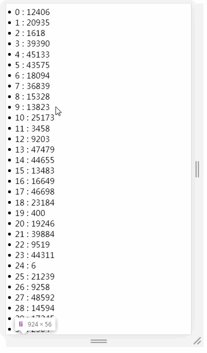

# 如何渲染几万条数据并不卡住界面

## 前言
在实际工作中，我们很少会遇到一次性需要向页面中插入数十万条数据的情况，但是为了丰富我们的知识体系，我们有必要了解并清楚当遇到大量数据时，如何才能在不卡主页面的情况下渲染数据，以及其中背后的原理。

## 最粗暴的做法（一次性渲染）

```html
<ul></ul>
```
```javascript
let now = Date.now();
// 插入十万条数据
const total = 100000;
let ul = document.querySelector('ul');
for (let i = 0; i < total; i++) {
    let li = document.createElement('li');
    li.innerText = Math.floor(Math.random() * total)
    ul.appendChild(li);
}
console.log('JS运行时间：',Date.now() - now);
setTimeout(()=>{
  console.log('总运行时间：',Date.now() - now);
},0)
// print: JS运行时间： 187
// print: 总运行时间： 2844
```

我们对二十万条记录进行循环操作，JS的运行时间为187ms，还是蛮快的，但是最终渲染完成后的总时间确是2844ms

我们可以得出结论，对于大量数据渲染的时候，JS运算并不是性能的瓶颈，性能的瓶颈主要在于渲染阶段

**PS：简单解释一下，为何上面的代码，两次 console.log 的结果时间差异巨大**
+ 在 JS 的 Event Loop 中，当JS引擎所管理的执行栈中的事件以及所有微任务事件全部执行完后，才会触发渲染线程对页面进行渲染
+ 第一个 console.log 的触发时间是在页面进行渲染之前，此时得到的间隔时间为JS运行所需要的时间
+ 第二个 console.log 是放到 setTimeout 中的，它的触发时间是在渲染完成，在下一次 Event Loop 中执行的

## 使用定时器
从上面的例子，我们已经知道，页面的卡顿是由于同时渲染大量DOM所引起的，所以我们考虑将渲染过程分批进行

在这里，我们使用 setTimeout 来实现分批渲染
```html
<ul></ul>
```
```javascript
/**
* 渲染
* @param start     开始渲染的索引
* @param once      一次渲染多少条
* @param total     剩余多少条需要渲染
*/
function render(dom,start,once,total){
    //获取真正渲染条数，渲染条数小于剩余总数，将渲染条数覆为盖剩余条数
    let curOnce = Math.min(once,total);
    //将渲染
    setTimeout(()=>{
      for(let i = 0; i < curOnce; i++){
        let li = document.createElement('li');
        li.innerText = start + i + ' : ' + Math.floor(Math.random() * total)
        dom.appendChild(li)
      }
    },0)
    //获取剩余条数
    let nextTotal = total - curOnce;
    //获取下次渲染索引
    let nextStart = start + curOnce;
    //进行下次渲染
    if(nextTotal > 0){
      render(dom,nextStart,once,nextTotal);
    }
}

// 插入十万条数据
const total = 100000;
// 一次插入 20 条，如果觉得性能不好就减少
const once = 20;
//需要插入的容器
let ul = document.querySelector('ul');

render(ul,0,once,total)
```
用一个gif图来看一下效果



我们可以看到，页面加载的时间已经非常快了，每次刷新时可以很快的看到第一屏的所有数据，但是当我们快速滚动页面的时候，会发现页面出现闪屏或白屏的现象

### 为什么会出现闪屏现象呢

大多数电脑显示器的刷新频率是60Hz，大概相当于每秒钟重绘60次，这个值的设定受屏幕分辨率、屏幕尺寸和显卡的影响。

因此，当你对着电脑屏幕什么也不做的情况下，大多显示器也会以每秒60次的频率正在不断的更新屏幕上的图像。
为什么你感觉不到这个变化？ 
那是因为人的眼睛有视觉停留效应，即前一副画面留在大脑的印象还没消失，紧接着后一副画面就跟上来了，
这中间只间隔了16.7ms(1000/60≈16.7)，所以会让你误以为屏幕上的图像是静止不动的。
而屏幕给你的这种感觉是对的，试想一下，如果刷新频率变成1次/秒，屏幕上的图像就会出现严重的闪烁，
这样就很容易引起眼睛疲劳、酸痛和头晕目眩等症状。

大多数浏览器都会对重绘操作加以限制，不超过显示器的重绘频率，因为即使超过那个频率用户体验也不会有提升。
因此，最平滑动画的最佳循环间隔是1000ms/60，约等于16.6ms。

### 简单聊一下 setTimeout 和闪屏现象

+ setTimeout 的执行时间并不是确定的。在JS中，setTimeout 任务被放进事件队列中，只有主线程执行完才会去检查事件队列中的任务是否需要执行，因此 setTimeout 的实际执行时间可能会比其设定的时间晚一些。
+ 刷新频率受屏幕分辨率和屏幕尺寸的影响，因此不同设备的刷新频率可能会不同，而 setTimeout 只能设置一个固定时间间隔，这个时间不一定和屏幕的刷新时间相同。

以上两种情况都会导致setTimeout的执行步调和屏幕的刷新步调不一致，从而引起丢帧现象。

## 使用 requestAnimationFrame

与setTimeout相比，requestAnimationFrame最大的优势是由系统来决定回调函数的执行时机。

如果屏幕刷新率是60Hz,那么回调函数就每16.7ms被执行一次，如果刷新率是75Hz，那么这个时间间隔就变成了1000/75=13.3ms，换句话说就是，requestAnimationFrame的步伐跟着系统的刷新步伐走。它能保证回调函数在屏幕每一次的刷新间隔中只被执行一次，这样就不会引起丢帧现象。

```html
<ul></ul>
```
```javascript
// 插入十万条数据
const total = 100000 ;
// 一次插入 20 条，如果觉得性能不好就减少
const once = 20 ;
// 渲染数据总共需要几次
const loopCount = total / once ;
let countOfRender = 0 ;
let ul = document.querySelector('ul') ;
function add() {
    for (let i = 0; i < once; i++) {
        const li = document.createElement('li');
        li.innerText = countOfRender * once + i + ' : ' + Math.floor(Math.random() * total);
        ul.appendChild(li);
    }
    countOfRender += 1;
    loop()
}
function loop() {
    if (countOfRender < loopCount) {
        window.requestAnimationFrame(add)
    }
}
loop()
```
看下效果


我们可以看到，页面加载的速度很快，并且滚动的时候，也很流畅没有出现闪烁丢帧的现象。

这就结束了么，还可以再优化么？

当然~~

## 使用 DocumentFragment

先解释一下什么是 DocumentFragment ，文献引用自[MDN](https://developer.mozilla.org/zh-CN/docs/Web/API/DocumentFragment)

> **DocumentFragment**，文档片段接口，表示一个没有父级文件的最小文档对象。它被作为一个轻量版的 Document 使用，用于存储已排好版的或尚未打理好格式的XML片段。最大的区别是因为 DocumentFragment 不是真实DOM树的一部分，它的变化不会触发 DOM 树的（重新渲染) ，且不会导致性能等问题。
        
> 可以使用 document.createDocumentFragment 方法或者构造函数来创建一个空的 DocumentFragment

从MDN的说明中，我们得知 DocumentFragments 是DOM节点，但并不是DOM树的一部分，可以认为是存在内存中的，所以将子元素插入到文档片段时不会引起页面回流。

最后修改代码如下：
```html
<ul></ul>
```
```javascript
// 插入十万条数据
const total = 100000 ;
// 一次插入 20 条，如果觉得性能不好就减少
const once = 20 ;
// 渲染数据总共需要几次
const loopCount = total / once ;
let countOfRender = 0 ;
let ul = document.querySelector('ul') ;
function add() {
    // 优化性能，插入不会造成回流
    const fragment = document.createDocumentFragment();
    for (let i = 0; i < once; i++) {
        const li = document.createElement('li');
        li.innerText = countOfRender * once + i + ' : ' + Math.floor(Math.random() * total);
        ul.appendChild(li);
        fragment.appendChild(li)
    }
    ul.appendChild(fragment);
    countOfRender += 1;
    loop()
}
function loop() {
    if (countOfRender < loopCount) {
        window.requestAnimationFrame(add)
    }
}
loop()
```


+ [博客首页](https://github.com/chenqf/blog)
+ [javascript 基础](https://github.com/chenqf/blog/blob/master/articles/javascript基础)
+ [javascript 进阶](https://github.com/chenqf/blog/blob/master/articles/javascript进阶)
+ [前端性能](https://github.com/chenqf/blog/blob/master/articles/前端性能)
