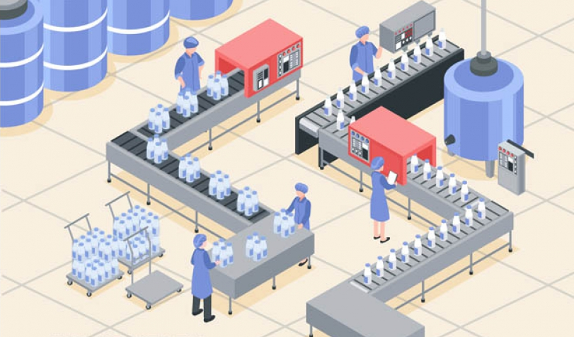

# 一次搞懂Event Loop

## 引子
几乎在每一本JS相关的书籍中，都会说JS是单线程的，JS是通过事件队列(Event Loop)的方式来实现异步回调的。
对很多初学JS的人来说，根本搞不清楚单线程的JS为什么拥有异步的能力，所以，我们试图从进程、线程的角度来解释这个问题。

## CPU

计算机的核心是CPU，它承担了所有的计算任务。

它就像一座工厂，时刻在运行。

## 进程

假定工厂的电力有限，一次只能供给一个车间使用。
也就是说，一个车间开工的时候，其他车间都必须停工。
背后的含义就是，单个CPU一次只能运行一个任务。

进程就好比工厂的车间，它代表CPU所能处理的单个任务。
进程之间相互独立，任一时刻，CPU总是运行一个进程，其他进程处于非运行状态。
CPU使用时间片轮转进度算法来实现同时运行多个进程。

## 线程

一个车间里，可以有很多工人，共享车间所有的资源，他们协同完成一个任务。

线程就好比车间里的工人，一个进程可以包括多个线程，多个线程共享进程资源。

## CPU、进程、线程之间的关系
从上文我们已经简单了解了CPU、进程、线程，简单汇总一下。

+ 进程是cpu资源分配的最小单位（是能拥有资源和独立运行的最小单位）
+ 线程是cpu调度的最小单位（线程是建立在进程的基础上的一次程序运行单位，一个进程中可以有多个线程）
+ 不同进程之间也可以通信，不过代价较大
+ 单线程与多线程，都是指在一个进程内的单和多

## 浏览器是多进程的

我们已经知道了CPU、进程、线程之间的关系，对于计算机来说，每一个应用程序都是一个进程，
而每一个应用程序都会分别有很多的功能模块，这些功能模块实际上是通过子进程来实现的。
对于这种子进程的扩展方式，我们可以称这个应用程序是多进程的。

而对于浏览器来说，浏览器就是多进程的，我们可以在 windows 下打开控制管理器:

如上图，我们可以看到一个IE浏览器启动了三个进程。

总结一下：
+ 浏览器是多进程的
+ 浏览器之所以能够运行，是因为系统给它的进程分配了资源（cpu、内存）
+ 简单点理解，每打开一个Tab页，就相当于创建了一个独立的浏览器进程。

## 浏览器包含了哪些进程

+ 主进程
    + 协调控制其他子进程（创建、销毁）
    + 浏览器界面显示，用户交互，前进、后退、收藏
    + 将渲染进程得到的内存中的Bitmap，绘制到用户界面上
    + 处理不可见操作，网络请求，文件访问等
+ 第三方插件进程
    + 每个插件一个进程，当时候的时候，进程被创建
+ GPU进程
    + 用于3D绘制等
+ **渲染进程，就是我们说的浏览器内核**
    + 负责页面渲染，脚本执行，事件处理等
    + 每个tab页一个渲染进程
    
那么浏览器中包含了这么多的进程，那么对于普通的前端操作来说，最重要的是什么呢？

答案是渲染进程，也就是我们常说的浏览器内核

## 浏览器内核（渲染进程）

从前文我们得知，进程和线程是一对多的关系，也就是说一个进程包含了多条线程。

而对于渲染进程来说，它当然也是多线程的了，接下来我们来看一下渲染进程包含哪些线程。

