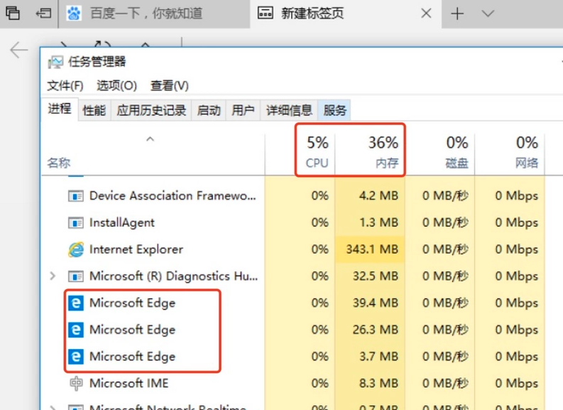
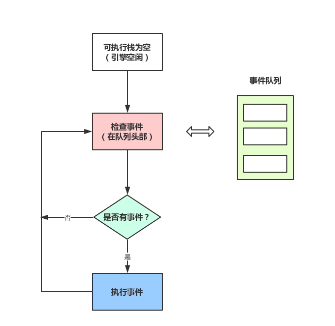

# 一次搞懂Event Loop

## 引子
几乎在每一本JS相关的书籍中，都会说JS是单线程的，JS是通过事件队列(Event Loop)的方式来实现异步回调的。
对很多初学JS的人来说，根本搞不清楚单线程的JS为什么拥有异步的能力，所以，我们试图从进程、线程的角度来解释这个问题。

## CPU

计算机的核心是CPU，它承担了所有的计算任务。

它就像一座工厂，时刻在运行。

## 进程

假定工厂的电力有限，一次只能供给一个车间使用。
也就是说，一个车间开工的时候，其他车间都必须停工。
背后的含义就是，单个CPU一次只能运行一个任务。

进程就好比工厂的车间，它代表CPU所能处理的单个任务。
进程之间相互独立，任一时刻，CPU总是运行一个进程，其他进程处于非运行状态。
CPU使用时间片轮转进度算法来实现同时运行多个进程。

## 线程

一个车间里，可以有很多工人，共享车间所有的资源，他们协同完成一个任务。

线程就好比车间里的工人，一个进程可以包括多个线程，多个线程共享进程资源。

## CPU、进程、线程之间的关系
从上文我们已经简单了解了CPU、进程、线程，简单汇总一下。

+ 进程是cpu资源分配的最小单位（是能拥有资源和独立运行的最小单位）
+ 线程是cpu调度的最小单位（线程是建立在进程的基础上的一次程序运行单位，一个进程中可以有多个线程）
+ 不同进程之间也可以通信，不过代价较大
+ 单线程与多线程，都是指在一个进程内的单和多

## 浏览器是多进程的

我们已经知道了CPU、进程、线程之间的关系，对于计算机来说，每一个应用程序都是一个进程，
而每一个应用程序都会分别有很多的功能模块，这些功能模块实际上是通过子进程来实现的。
对于这种子进程的扩展方式，我们可以称这个应用程序是多进程的。

而对于浏览器来说，浏览器就是多进程的，我们可以在 windows 下打开控制管理器:

如上图，我们可以看到一个IE浏览器启动了三个进程。

总结一下：
+ 浏览器是多进程的
+ 浏览器之所以能够运行，是因为系统给它的进程分配了资源（cpu、内存）
+ 简单点理解，每打开一个Tab页，就相当于创建了一个独立的浏览器进程。

## 浏览器包含了哪些进程

+ 主进程
    + 协调控制其他子进程（创建、销毁）
    + 浏览器界面显示，用户交互，前进、后退、收藏
    + 将渲染进程得到的内存中的Bitmap，绘制到用户界面上
    + 处理不可见操作，网络请求，文件访问等
+ 第三方插件进程
    + 每个插件一个进程，当时候的时候，进程被创建
+ GPU进程
    + 用于3D绘制等
+ **渲染进程，就是我们说的浏览器内核**
    + 负责页面渲染，脚本执行，事件处理等
    + 每个tab页一个渲染进程
    
那么浏览器中包含了这么多的进程，那么对于普通的前端操作来说，最重要的是什么呢？

答案是渲染进程，也就是我们常说的浏览器内核

## 浏览器内核（渲染进程）

从前文我们得知，进程和线程是一对多的关系，也就是说一个进程包含了多条线程。

而对于渲染进程来说，它当然也是多线程的了，接下来我们来看一下渲染进程包含哪些线程。

+ **GUI渲染线程**
    + 负责渲染页面，布局和绘制
    + 页面需要重绘和回流时，该线程就会执行
    + 与js引擎线程互斥，防止渲染结果不可预期
+ **JS引擎线程**
    + 负责处理解析和执行javascript脚本程序
    + 只有一个JS引擎线程（单线程）
    + 与GUI渲染线程互斥，防止渲染结果不可预期
+ **事件触发线程**
    + 用来控制事件循环（鼠标点击、setTimeout、ajax等）
    + 当事件满足触发条件时，将事件放入到JS引擎所在的执行队列中
+ **定时触发器线程**
    + setInterval与setTimeout所在的线程
    + 定时任务并不是由JS引擎计时的，是由定时触发线程来计时的
    + 计时完毕后，通知事件触发线程
+ **异步http请求线程**
    + 浏览器有一个单独的线程用于处理AJAX请求
    + 当请求完成时，若有回调函数，通知时间触发线程
    
当我们了解了渲染进程包含的这些线程后，我们思考两个问题：
1. 为什么 javascript 是单线程的
2. 为什么 GUI 渲染线程为什么与 JS 引擎线程互斥

### 为什么 javascript 是单线程的

首先是历史原因，在创建 javascript 这门语言时，多进程多线程的架构并不流行，硬件支持并不好。

其次是因为多线程的复杂性，多线程操作需要加锁，编码的复杂性会增高。

而且，如果同时操作 DOM ，在多线程不加锁的情况下，最终会导致 DOM 渲染的结果不可预期。

### 为什么 GUI 渲染线程为什么与 JS 引擎线程互斥

这是由于 JS 是可以操作 DOM 的，如果同时修改元素属性并同时渲染界面(即 JS 线程和 UI 线程同时运行)，
那么渲染线程前后获得的元素就可能不一致了。

因此，为了防止渲染出现不可预期的结果，浏览器设定 GUI 渲染线程和 JS 引擎线程为互斥关系，
当 JS 引擎线程执行时 GUI 渲染线程会被挂起，GUI 更新则会被保存在一个队列中等待 JS 引擎线程空闲时立即被执行。

## 从 Event Loop 看 JS 的运行机制

到了这里，终于要进入我们的主题，什么是 Event Loop

先理解一些概念：
+ JS 分为同步任务和异步任务
+ 同步任务都在JS引擎线程上执行，形成一个**执行栈**
+ 事件触发线程管理一个**任务队列**，异步任务触发条件达成，将回调事件放到**任务队列**中
+ **执行栈**中所有同步任务执行完毕，此时JS引擎线程空闲，系统会读取**任务队列**，将可运行的异步任务回调事件添加到**执行栈**中，开始执行

