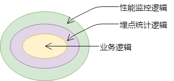

# JS中的面向切面编程

## 前言

面向切面编程（Aspect-oriented programming，AOP）是一种编程范式，在后端开发中被广泛的应用(遥记当前学习spring时的血泪史)，可是在 JavaScript 中，AOP 往往是一个被忽视的技术点。

## AOP到底是什么

先来思考一个场景：

我们有一个表单，其中若干输入框，一个提交按钮，点击按钮时，获取输入框的所有值并向后端发请求，按钮的点击事件函数可能是这样的：

```javascript
function submit(){
    //业务代码--获取所有输入框的值
    let params = getAllInputValue();
    //业务代码--像后端发送请求
    request(url,params);
}
```

后来，我们希望能够统计按钮的点击次数，需要添加埋点信息，我们的代码变成了这样：

```javascript
function submit(){
    //发送埋点信息
    tracking('submit');
    //业务代码--获取所有输入框的值
    let params = getAllInputValue();
    //业务代码--像后端发送请求
    request(url,params)
}
```

再后来，我们希望对按钮事件进行性能监控，查看事件的运行时间，我们的代码又变成了这样：

```javascript
function submit(){
    //记录开始时间
    console.time('性能监控');
    //发送埋点信息
    tracking('submit');
    //业务代码--获取所有输入框的值
    let params = getAllInputValue();
    //业务代码--像后端发送请求
    request(url,params)
    //记录结束时间
    console.timeEnd('性能监控');
}
```

乍一看，貌似没什么问题，我们完美的完成了需求。但仔细的看这段代码，会发现我们的业务代码淹没在重复化非业务性的代码中，性能监控和埋点统计这些非业务性代码葛藤缠树般包围着业务代码。

现在我们假设将 submit 函数看成一段圆木，我们会发现性能监控和埋点统计的代码好像一个年轮，而业务代码是圆木的树心，而这也就是`面向切面编程`这个概念的由来。



为了消除依附在业务方法流程中的横切逻辑，AOP独辟蹊径通过横向抽取机制来解决这一问题。


在知道了什么是 AOP 之后，我们再来看，在 JS 中是如何应用 AOP的。

## 关注点分离


当然，我们知道将这些重复性的横切逻辑独立出来是很容易的，但是如何将这些独立的逻辑融合到业务逻辑中完成和原来一样的业务操作，这才是事情的关键，也正是 AOP 要解决的主要问题。


AOP的好处首先是可以保持业务逻辑模块的纯净和高内聚性


将众多方法中的公用代码提取集中管理，在具体运行时再由容器动态植入，最起码可解决两个问题：

开发者编写具体业务逻辑处理方法时，只需关心核心业务逻辑处理，提高效率同时代码简洁。
日后维护中由于业务逻辑与公共代码分离，使得维护工作更为轻松。


https://www.cnblogs.com/pqjwyn/p/9858352.html


https://juejin.im/post/5cc2e15651882525041c64b5?utm_source=gold_browser_extension%20https%3A%2F%2Fwww.cnblogs.com%2FWolfmanlq%2Fp%2F6036019.html


https://www.cnblogs.com/dojo-lzz/p/4470278.html


https://segmentfault.com/a/1190000008402458

http://www.alloyteam.com/2013/08/yong-aop-gai-shan-javascript-dai-ma/

