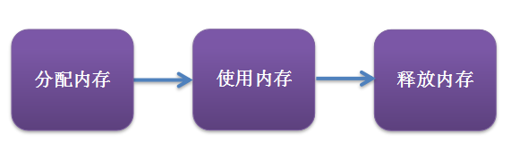

# JS中的内存管理

## 前言

像C语言这样的底层语言一般都有底层的内存管理接口，比如 malloc()和free()用于分配内存和释放内存。
而对于JavaScript来说，会在创建变量（对象，字符串等）时分配内存，并且在不再使用它们时“自动”释放内存，这个自动释放内存的过程称为垃圾回收。
因为自动垃圾回收机制的存在，让大多Javascript开发者感觉他们可以不关心内存管理，所以会在一些情况下导致内存泄漏。


## 内存生命周期



JS 环境中分配的内存有如下声明周期：
1. 内存分配：当我们申明变量、函数、对象的时候，系统会自动为他们分配内存
2. 内存使用：即读写内存，也就是使用变量、函数等
3. 内存回收：使用完毕，由垃圾回收机制自动回收不再使用的内存

### JS 的内存分配

为了不让程序员费心分配内存，JavaScript 在定义变量时就完成了内存分配。
```javascript
var n = 123; // 给数值变量分配内存
var s = "azerty"; // 给字符串分配内存

var o = {
  a: 1,
  b: null
}; // 给对象及其包含的值分配内存

// 给数组及其包含的值分配内存（就像对象一样）
var a = [1, null, "abra"]; 

function f(a){
  return a + 2;
} // 给函数（可调用的对象）分配内存

// 函数表达式也能分配一个对象
someElement.addEventListener('click', function(){
  someElement.style.backgroundColor = 'blue';
}, false);
```

有些函数调用结果是分配对象内存：
```javascript
var d = new Date(); // 分配一个 Date 对象

var e = document.createElement('div'); // 分配一个 DOM 元素
```

有些方法分配新变量或者新对象：
```javascript
var s = "azerty";
var s2 = s.substr(0, 3); // s2 是一个新的字符串
// 因为字符串是不变量，
// JavaScript 可能决定不分配内存，
// 只是存储了 [0-3] 的范围。

var a = ["ouais ouais", "nan nan"];
var a2 = ["generation", "nan nan"];
var a3 = a.concat(a2); 
// 新数组有四个元素，是 a 连接 a2 的结果
```

### JS 的内存使用

使用值的过程实际上是对分配内存进行读取与写入的操作。
读取与写入可能是写入一个变量或者一个对象的属性值，甚至传递函数的参数。

```javascript
var a = 10; // 分配内存
console.log(a); // 对内存的使用
```

### JS 的内存回收

JS 有自动垃圾回收机制，那么这个自动垃圾回收机制的原理是什么呢？
其实很简单，就是找出那些不再继续使用的值，然后释放其占用的内存。

大多数内存管理的问题都在这个阶段。在这里最艰难的任务是找到“所分配的内存确实已经不再需要了”。

因为自动垃圾回收机制的存在，开发人员可以不关心也不注意内存释放的有关问题，但对无用内存的释放这件事是客观存在的。
不幸的是，即使不考虑垃圾回收对性能的影响，目前最新的垃圾回收算法，也无法智能回收所有的极端情况。

接下来我们来探究一下 JS 垃圾回收的机制。

## 垃圾回收

### 引用

垃圾回收算法主要依赖于引用的概念。

在内存管理的环境中，一个对象如果有访问另一个对象的权限（隐式或者显式），叫做一个对象引用另一个对象。

例如，一个Javascript对象具有对它原型的引用（隐式引用）和对它属性的引用（显式引用）。

在这里，“对象”的概念不仅特指 JavaScript 对象，还包括函数作用域（或者全局词法作用域）。

### 引用计数垃圾收集

这是最初级的垃圾回收算法。

引用计数算法定义“内存不再使用”的标准很简单，就是看一个对象是否有指向它的引用。
如果没有其他对象指向它了，说明该对象已经不再需了。

```javascript
var o = { 
  a: {
    b:2
  }
}; 
// 两个对象被创建，一个作为另一个的属性被引用，另一个被分配给变量o
// 很显然，没有一个可以被垃圾收集


var o2 = o; // o2变量是第二个对“这个对象”的引用

o = 1;      // 现在，“这个对象”的原始引用o被o2替换了

var oa = o2.a; // 引用“这个对象”的a属性
// 现在，“这个对象”有两个引用了，一个是o2，一个是oa

o2 = "yo"; // 最初的对象现在已经是零引用了
           // 他可以被垃圾回收了
           // 然而它的属性a的对象还在被oa引用，所以还不能回收

oa = null; // a属性的那个对象现在也是零引用了
           // 它可以被垃圾回收了
```

由上面可以看出，引用计数算法是个简单有效的算法。但它却存在一个致命的问题：循环引用。

如果两个对象相互引用，尽管他们已不再使用，垃圾回收不会进行回收，导致内存泄露。

来看一个循环引用的例子：

```javascript
function f(){
  var o = {};
  var o2 = {};
  o.a = o2; // o 引用 o2
  o2.a = o; // o2 引用 o  这里

  return "azerty";
}

f();
```

上面我们申明了一个函数 f ，其中包含两个相互引用的对象。
在调用函数结束后，对象 o1 和 o2 实际上已离开函数范围，因此不再需要了。
但根据引用计数的原则，他们之间的相互引用依然存在，因此这部分内存不会被回收，内存泄露不可避免了。

再来看一个实际的例子：

```javascript
var div = document.createElement("div");
div.onclick = function() {
    console.log("click");
};
```
上面这种JS写法再普通不过了，创建一个DOM元素并绑定一个点击事件。
此时变量 div 有事件处理函数的引用，同时事件处理函数也有div的引用！（div变量可在函数内被访问）。
一个循序引用出现了，按上面所讲的算法，该部分内存无可避免的泄露了。

为了解决循环引用造成的问题，现代浏览器通过使用标记清除算法来实现垃圾回收。

### 标记清除算法

标记清除算法将“不再使用的对象”定义为“无法达到的对象”。
简单来说，就是从根部（在JS中就是全局对象）出发定时扫描内存中的对象。
凡是能从根部到达的对象，都是还需要使用的。
那些无法由根部出发触及到的对象被标记为不再使用，稍后进行回收。

从这个概念可以看出，无法触及的对象包含了没有引用的对象这个概念（没有任何引用的对象也是无法触及的对象）。
但反之未必成立。


#### 循环引用不再是问题了

再看之前循环引用的例子：
```javascript
function f(){
  var o = {};
  var o2 = {};
  o.a = o2; // o 引用 o2
  o2.a = o; // o2 引用 o

  return "azerty";
}

f();
```
函数调用返回之后，两个对象从全局对象出发无法获取。因此，他们将会被垃圾回收器回收。

## 内存泄漏

### 什么是内存泄漏

程序的运行需要内存。只要程序提出要求，操作系统或者运行时（runtime）就必须供给内存。

对于持续运行的服务进程（daemon），必须及时释放不再用到的内存。
否则，内存占用越来越高，轻则影响系统性能，重则导致进程崩溃。

本质上讲, 内存泄露就是不再被需要的内存, 由于某种原因, 无法被释放。

### 内存泄漏的识别方法


## 常见的内存泄露案例
